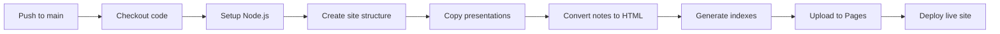

# GitHub Pages Setup Guide

> **Purpose**: Auto-publish visual presentations and notes to GitHub Pages
> **Status**: Ready to deploy
> **Last Updated**: 2026-03-03

---

## 🚀 Quick Start

### Step 1: Enable GitHub Pages

1. Go to your repository on GitHub
2. Click **Settings** → **Pages** (left sidebar)
3. Under **Source**, select:
   - Source: **GitHub Actions** (not "Deploy from a branch")
4. Click **Save**

That's it! The workflow is already configured in `.github/workflows/publish-pages.yml`

### Step 2: Push Your Code

```bash
# Add all files
git add .

# Commit with message
git commit -m "Add checkpoint system with GitHub Pages deployment"

# Push to main branch
git push origin main
```

### Step 3: Wait for Deployment

1. Go to **Actions** tab in your repository
2. Watch the "Publish to GitHub Pages" workflow run
3. When complete, your site will be live at:
   ```
   https://<username>.github.io/<repository-name>/
   ```

---

## 📋 What Gets Published

The workflow automatically deploys:

| Content | Source | Destination |
|---------|--------|-------------|
| **Visual Presentations** | `visual-presentations/*.html` | `/presentations/` |
| **Concept Map** | `visual-presentations/concept-map.html` | `/concept-map.html` |
| **Checkpoint Notes** | `revision-notes/**/*.md` | `/notes/**/*.html` (converted) |
| **Quick Reference** | `quick-reference/*.md` | `/quick-ref/*.html` (converted) |
| **Landing Page** | Auto-generated | `/index.html` |

---

## 🎯 Site Structure

Your published site will look like this:

```
https://username.github.io/agent-factory-part-1/
├── index.html                    # Landing page with links
├── concept-map.html              # Interactive knowledge graph
├── presentations/
│   ├── index.html               # Presentations directory
│   ├── session-01-lesson-3.1-origin-story.html
│   └── session-01-lesson-3.1-L1-presentation.html
├── notes/
│   ├── index.html               # Notes directory
│   ├── ch3-general-agents/
│   │   ├── module3/
│   │   │   └── 3.1-origin-story/
│   │   │       ├── 3.1-L1-hook-architecture.html
│   │   │       ├── 3.1-L2-custom-hooks.html
│   │   │       └── 3.1-L3-advanced-patterns.html
│   └── ...
└── quick-ref/
    ├── index.html               # Quick reference directory
    ├── lesson-3.1-cheatsheet.html
    └── ...
```

---

## ⚙️ How It Works

### Workflow Triggers

The workflow runs automatically when:

1. **Push to main branch** with changes in:
   - `visual-presentations/`
   - `revision-notes/`
   - `quick-reference/`
   - `context-bridge/`
   - Workflow file itself

2. **Manual trigger**: Actions tab → "Publish to GitHub Pages" → "Run workflow"

### Build Process



1. **Checkout**: Clone repository
2. **Setup**: Install dependencies (Node.js, Pandoc)
3. **Copy**: Move visual presentations as-is
4. **Convert**: Transform markdown → HTML with Pandoc
5. **Generate**: Create index pages automatically
6. **Upload**: Package everything as site artifact
7. **Deploy**: Publish to GitHub Pages

---

## 🛠️ Customization

### Change Branch

Edit `.github/workflows/publish-pages.yml`:

```yaml
on:
  push:
    branches:
      - main  # Change to your branch name
```

### Add Custom Domain

1. Go to Settings → Pages
2. Under "Custom domain", enter your domain
3. Add CNAME record in your DNS:
   ```
   CNAME: <username>.github.io
   ```
4. Wait for DNS propagation (up to 24 hours)
5. Enable "Enforce HTTPS"

### Customize Landing Page

Edit the `Create index page` step in `publish-pages.yml` to modify the homepage

### Add Google Analytics

Insert before `</head>` in index.html:

```html
<!-- Google tag (gtag.js) -->
<script async src="https://www.googletagmanager.com/gtag/js?id=G-XXXXXXXXXX"></script>
<script>
  window.dataLayer = window.dataLayer || [];
  function gtag(){dataLayer.push(arguments);}
  gtag('js', new Date());
  gtag('config', 'G-XXXXXXXXXX');
</script>
```

---

## 🔍 Troubleshooting

### Issue: Workflow Fails

**Check:**
1. Actions tab → Failed workflow → View logs
2. Common causes:
   - Missing Pandoc (should auto-install)
   - Malformed markdown
   - Empty directories

**Fix:**
```bash
# Test locally
find revision-notes -name "*.md" -exec pandoc {} --to html5 -o /tmp/test.html \;
```

### Issue: 404 Page Not Found

**Check:**
1. Settings → Pages → Ensure "GitHub Actions" selected (not branch)
2. Wait 2-3 minutes after deployment completes
3. Clear browser cache

**Fix:**
```bash
# Force re-deploy
git commit --allow-empty -m "Trigger deployment"
git push
```

### Issue: Styles Missing

**Cause:** Self-contained HTML generation

**Fix:** Already handled by `--self-contained` flag in workflow

### Issue: Large Repository Warning

**Cause:** GitHub Pages has 1GB soft limit

**Fix:**
```bash
# Exclude large files from deployment
# Add to .gitignore:
*.mp4
*.mov
*.zip
exports/
```

---

## 📊 Monitoring

### View Deployment Status

1. **Actions Tab**: See all workflow runs
2. **Environments**: Settings → Environments → github-pages
3. **History**: See past deployments with timestamps

### Analytics

Track visitors with:
- **GitHub Traffic**: Insights → Traffic (14-day history)
- **Google Analytics**: Add GA4 tag (see Customization)
- **Plausible/Fathom**: Privacy-focused alternatives

---

## 🔒 Permissions

The workflow requires:

```yaml
permissions:
  contents: read      # Read repository files
  pages: write        # Deploy to Pages
  id-token: write     # Verify deployment identity
```

These are automatically granted to the workflow.

---

## 🚀 Advanced Features

### Multi-Language Support

Add to workflow:

```yaml
- name: Generate in multiple languages
  run: |
    # Build English version
    mkdir -p _site/en
    # Build translations
    mkdir -p _site/es
    # Copy to subdirectories
```

### Search Integration

Add Lunr.js or Algolia:

1. Generate search index during build
2. Add search UI to index.html
3. Enable client-side search

### Progressive Web App

Add `manifest.json` and service worker for offline access

---

## 📚 Resources

- **GitHub Pages Docs**: https://docs.github.com/en/pages
- **GitHub Actions**: https://docs.github.com/en/actions
- **Pandoc Manual**: https://pandoc.org/MANUAL.html

---

## ✅ Checklist

Before first deploy:

- [ ] Repository is public (or GitHub Pro for private Pages)
- [ ] Workflow file exists at `.github/workflows/publish-pages.yml`
- [ ] GitHub Pages enabled in Settings → Pages → Source: GitHub Actions
- [ ] At least one presentation or note exists
- [ ] Pushed to main branch
- [ ] Workflow completed successfully in Actions tab
- [ ] Site accessible at `https://<username>.github.io/<repo>/`

---

## 🎓 Next Steps

After deployment:

1. **Share the link** with study group or mentors
2. **Add badge** to README:
   ```markdown
   [](https://github.com/<user>/<repo>/actions/workflows/publish-pages.yml)
   ```
3. **Enable discussions** (Settings → General → Features → Discussions)
4. **Create study schedule** linked to published materials
5. **Track progress** with GitHub Projects board

---

**Questions?** Open an issue or check GitHub Pages documentation

**Ready to deploy?** Push to main and watch the magic happen! ✨
