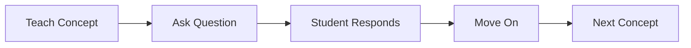
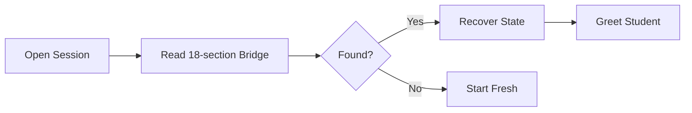
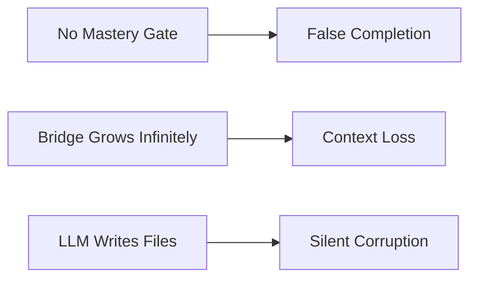
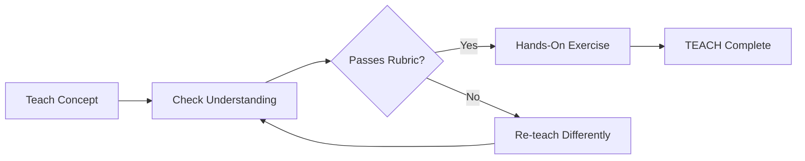
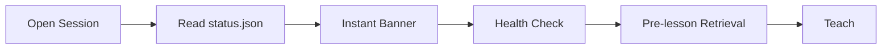
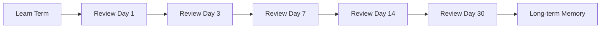
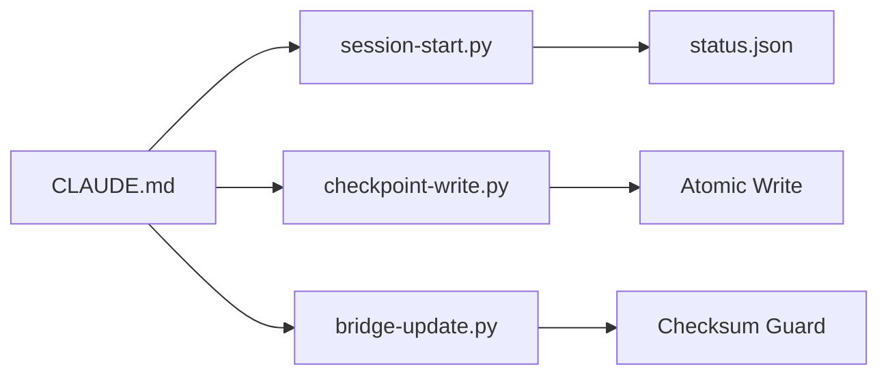
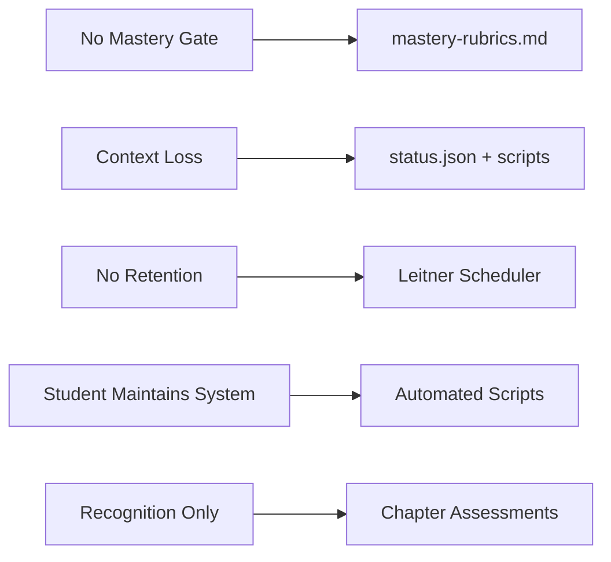

# 🔄 Agent Factory: Before & After Transformation

A plain-English record of how the AI tutoring system evolved — what it was, what broke, what changed, and why it matters.

---

## 🏁 Section 1: The Starting Point (BEFORE)

The original system was a well-intentioned tutor that had one fundamental flaw: **it trusted students to self-report understanding.** A student could type "I get it" and the lesson would move on — no verification, no gate, no second chance.

Sessions also had a memory problem. Every checkpoint would append to a single growing markdown file with 18 sections. Over time, that file ballooned. When the LLM tried to read it at session start, it was slow and unreliable — and if the file was partially corrupt, nobody noticed.

The student was also expected to manage the system: remember 12 commands, know when to checkpoint, handle repairs manually. That's cognitive overhead stolen from actual learning.



*Old Flow — No Gate*

---



*Old Cold Start — Slow & Unreliable*

---

## 🔍 Section 2: What Was Broken (ROOT CAUSES)

Five root causes drove most of the pain:

1. **No mastery gate** — finishing a lesson did not mean understanding it. Completion equaled forward progress, even if the student was confused.
2. **Infinite bridge growth** — the context bridge file had no size discipline. It grew session after session until the LLM couldn't reliably hold the whole thing in context.
3. **LLM as executor** — asking an LLM to write files, manage JSON, and run workflows is asking a probabilistic system to do deterministic work. Silent corruption was inevitable.
4. **No retention science** — lessons were taught beautifully, then never revisited. The forgetting curve was completely ignored.
5. **Student maintains the system** — the student had to remember commands, trigger repairs, and know system internals. That's the opposite of a learning environment.



*Three Root Causes*

---

## ✅ Section 3: The Transformation (AFTER)

Every root cause got a targeted fix. Here's the full comparison:

| Area | Before | After |
|------|--------|-------|
| Mastery check | Ask question → always move on | Rubric gate → re-teach loop (max 3) → flag |
| Session start | Read 18-section file | Read 200-byte status.json instantly |
| HTML generation | LLM writes raw HTML | Python template + LLM fills content slots |
| Retention | Teach once, forget | Spaced review: 1→3→7→14→30 day intervals |
| Vocabulary | Re-define every lesson | Fade after 2 lessons → student recalls |
| Commands | 12 commands to memorize | Scripts handle it — student types less |
| Write safety | Direct file writes | Atomic: tmp → validate → rename |
| Failure detection | Silent (no alerts) | `repair_needed` flag in status.json |
| Chapter completion | Last lesson = chapter done | Chapter Assessment required (no hints) |
| Student profile | Static forever | Evolves at L1→L2→L3 milestones |

> **Key insight**: The single biggest win was separating *what the LLM does well* (teaching, explaining, questioning) from *what scripts do better* (file writes, state management, scheduling).



*New Flow — Mastery Gated*

---



*New Cold Start — Fast & Verified*

---



*Leitner Spaced Review*

---

## 📁 Section 4: New Files Created

### Scripts
- `scripts/session-start.py` — reads status.json, renders recovery banner, runs health check
- `scripts/checkpoint-write.py` — atomic tmp → validate → rename write pipeline
- `scripts/bridge-update.py` — checksum-guarded bridge appends with corruption detection
- `scripts/spaced-review-scheduler.py` — Leitner interval calculator, writes review queue
- `scripts/generate-html.py` — Jinja2-based HTML renderer (replaces LLM raw HTML writes)
- `scripts/generate-index.py` — proper INDEX.html generator (replaces ad-hoc version)

### Knowledge Vault — Assessment
- `Knowledge_Vault/Assessment/mastery-rubrics.md` — four-level pass/fail rubrics with example responses
- `Knowledge_Vault/Assessment/chapter-assessment.md` — end-of-chapter tests, no hints, prerequisite gate

### Knowledge Vault — Protocols
- `Knowledge_Vault/Protocols/spaced-review.md` — Leitner scheduler spec and review session format
- `Knowledge_Vault/Protocols/health-check.md` — session-start validation checklist

### Knowledge Vault — Student
- `Knowledge_Vault/Student/profile-evolution.md` — milestone rules for L1→L2→L3 transitions

### Templates
- `templates/lesson-presentation.html.j2` — Jinja2 template with content slots for HTML output

### Dev Docs
- `dev-docs/RELIABILITY-AUDIT.md` — full audit of every unreliable system pattern
- `dev-docs/BEFORE-AFTER-TRANSFORMATION.md` — this file

### Context Bridge
- `context-bridge/status.json` — 200-byte fast-path state file replacing full bridge on cold start



*Script Layer — Reliability*

---

## 🛠 Section 5: Files Modified

| File | What Changed |
|------|-------------|
| `CLAUDE.md` | status.json fast path, pre-lesson retrieval step, health-check, loop counter, scaffold fading |
| `Knowledge_Vault/Pedagogy/teach-cycle.md` | Mastery gate after C-step, vocabulary gate before E-step, exercise completion gate |
| `Knowledge_Vault/Pedagogy/pacing-rules.md` | Rules 7-9: scaffold fading, pre-lesson retrieval, interleaved review |
| `Knowledge_Vault/Protocols/finish-synthesis.md` | Pre-Finish confirmation, auto-Verify stage, Anki flashcard schema |
| `Knowledge_Vault/Assessment/chapter-assessment.md` | Prerequisite validation gate (Step 0) |
| `Knowledge_Vault/Protocols/rewind-checkpoint.md` | CONFIRM gate before destructive rewind |
| `Knowledge_Vault/Protocols/resume-protocol.md` | FAST START block — status.json first |
| `context-bridge/master-cumulative.md` | Sections 17-18 added, vocab bank columns extended |
| `context-bridge/README.md` | Spaced review fields, silent failure detection docs |
| `Knowledge_Vault/Assessment/mastery-rubrics.md` | Pass/fail example responses added |
| `Knowledge_Vault/00-VAULT-INDEX.md` | 4 new trigger routes added |
| `scripts/generate-index.py` | Replaced with proper INDEX.html generator |

---

## 🎯 Section 6: Problems Solved

**Problem 1: No mastery gate**
- Before: Student says "I understand" → lesson advances automatically.
- After: Student answer scored against rubric → below threshold triggers a different re-teach attempt (max 3), then flags for human review.

**Problem 2: Context loss between sessions**
- Before: LLM reads an 18-section markdown file on every cold start — slow, fragile, context-consuming.
- After: `status.json` (200 bytes) gives instant state recovery; full bridge only loaded on demand.

**Problem 3: LLM writing files directly**
- Before: LLM outputs raw file content → silent truncation, encoding errors, no validation.
- After: Scripts handle all writes with atomic tmp → validate → rename pattern and checksum guards.

**Problem 4: No retention mechanism**
- Before: Concepts taught once, never revisited in structured way — forgetting curve ignored entirely.
- After: Leitner 5-interval scheduler surfaces concepts at day 1, 3, 7, 14, 30 after first exposure.

**Problem 5: Student manages the system**
- Before: Student must remember 12 commands, trigger repairs, know internal file structure.
- After: Session-start script auto-detects state, auto-runs health check, auto-surfaces repairs.



*5 Problems → 5 Solutions*

---

## 📊 Section 7: Numbers Summary

```
BEFORE                              AFTER
────────────────────────────────────────────────────
0 mastery rubrics            →    4 mastery levels (L1–L4)
0 spaced review              →    Leitner 5-interval system
12 student commands          →    Scripts handle most automatically
1 cold-start file read       →    status.json (200 bytes, instant)
0 atomic writes              →    All bridge writes: tmp→validate→rename
0 chapter assessments        →    1 per chapter (6 total when complete)
0 profile evolution          →    3 milestones (L1/L2/L3 transitions)
LLM-written HTML             →    Jinja2 template (consistent every time)
35 Knowledge Vault files     →    42 files (7 new high-value additions)
0 scripts for reliability    →    6 purpose-built Python scripts
```

> **The biggest shift**: Moving from "the LLM does everything" to "the LLM teaches, scripts manage state." Each system does what it's actually good at.

---

## 🔮 Section 8: What's Still Possible

These are real improvements that could come next — none of them are blockers for a great learning experience today.

- **Full SQLite state store** — if the markdown bridge ever proves unreliable at scale, a local SQLite database would give transactional safety and instant queries without touching files.
- **Native Anki export** — generating `.apkg` files directly so flashcard decks load into Anki desktop with one click, no manual import.
- **Multi-student support** — separate `status.json` and bridge files per student, with a shared curriculum base. One tutor, many learners.
- **Web analytics dashboard** — a local browser dashboard showing streak data, mastery scores per lesson, and spaced review queue length.
