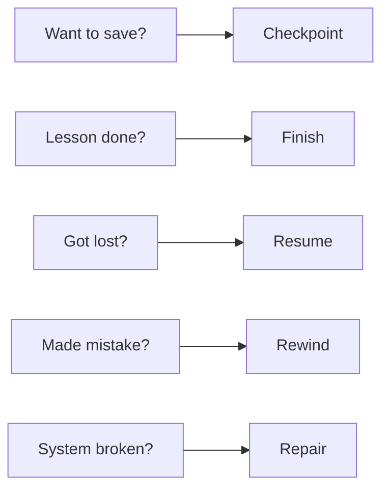
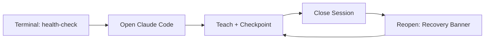
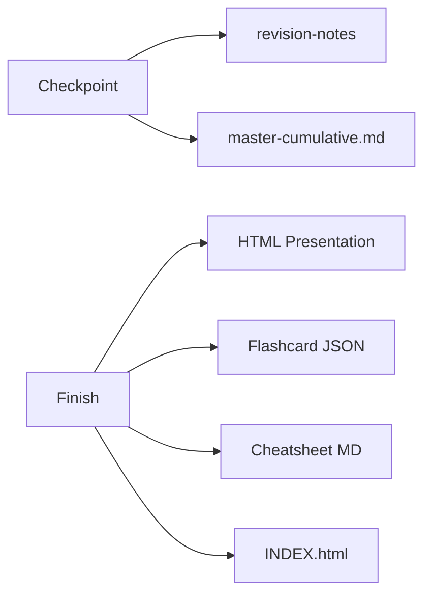

# Agent Factory — Commands & Test Cheatsheet

> **One rule**: Every section answers "What do I actually type?"
> No theory. No explanation of why. Just type this, see that.

---

## SECTION 1: Terminal Commands

Run from repo root: `cd /root/code/Agent-Factory-Mastery-Lab/.claude/worktrees/updating-stuff`

### Health & Status

| Command | What it does | Expected output |
|---------|-------------|-----------------|
| `python3 scripts/health-check.py` | Checks system is healthy | `✅ HEALTHY — All 3 checks passed` |
| `python3 scripts/session-start.py` | Shows recovery banner as JSON | JSON with banner, session count, health status |
| `cat context-bridge/status.json` | Check current lesson state | JSON showing lesson / layer / concept |

### Generating Artifacts

| Command | What it does | Expected output |
|---------|-------------|-----------------|
| `python3 scripts/generate-html.py --demo` | Creates a demo HTML presentation | `✅ HTML generated: visual-presentations/demo-...` |
| `python3 scripts/generate-index.py` | Rebuilds the lesson INDEX.html | `✅ INDEX.html generated` |

### Backup & Bridge Updates

| Command | What it does | Expected output |
|---------|-------------|-----------------|
| `python3 scripts/checkpoint-write.py --action backup` | Backs up the bridge file | `✅ Bridge backed up to: context-bridge/backup/...` |
| `python3 scripts/checkpoint-write.py --action update-status --lesson 3.1 --layer L1 --concept "Hook Architecture"` | Manually update status.json | `✅ status.json updated` |
| `python3 scripts/bridge-update.py --section 17 --content "pipe-separated row"` | Appends a row to bridge section 17 | `✅ Appended to Section 17` |

### Checking What Was Created

| Command | What it does | Expected output |
|---------|-------------|-----------------|
| `ls context-bridge/backup/` | Check backup files exist | List of dated backup files |
| `ls visual-presentations/` | Check generated HTML files | List of lesson HTML files |
| `ls flashcards/` | Check flashcard files | List of JSON deck files |
| `ls quick-reference/` | Check cheatsheet files | List of markdown cheatsheets |

### Setup

| Command | What it does | Expected output |
|---------|-------------|-----------------|
| `pip install jinja2` | Install HTML template engine | `Successfully installed jinja2` |

### Reset to Fresh Start

Run this when you want to wipe all session progress and start over:

```bash
python3 -c "
import json
data = {
  'lesson':'none','layer':'none','concept':'none',
  'last_checkpoint':'never','message_count_since_checkpoint':0,
  'session_count':0,'status':'fresh_start',
  'next_review_due_count':0,'last_updated':'2026-03-29'
}
open('context-bridge/status.json','w').write(json.dumps(data,indent=2))
print('✅ Reset to fresh start')
"
```

---

## SECTION 2: Chat Commands

Type these IN the Claude Code chat window.

### Command Decision Tree



### Core Teaching Commands

| What to type | What happens |
|-------------|-------------|
| **`start`** or **`begin`** | Starts from Chapter 1, Lesson 1 |
| **`Teach me Chapter 1`** | Starts teaching from Chapter 1, Lesson 1 |
| **`lesson 3.1`** | Jumps directly to lesson 3.1 |
| **`continue`** | Resumes from where you left off |
| **`Next`** | Moves to next concept in current lesson |
| **`I understand, move on`** | Signals readiness to proceed |
| **`Go slower`** or **`simplify`** | Agent re-explains with simpler terms and a new analogy |
| **`go deeper`** | More depth, edge cases, and advanced detail on current topic |
| **`Give me another example`** or **`exercise`** | Agent provides an additional practice exercise |
| **`explain [term]`** | Full explanation of any vocabulary term with examples |
| **`connect [A] to [B]`** | Explains the relationship between two concepts |
| **`show connections`** | Shows how current topic connects to all other chapters |
| **`anti-patterns`** | Lists all anti-patterns relevant to the current chapter |

### Save & Progress Commands

| What to type | What happens | Confirmation you see |
|-------------|-------------|---------------------|
| **`Checkpoint`** | Saves progress, continues teaching | `Checkpoint L{N} complete. Resuming from...` |
| **`Save progress`** | Same as Checkpoint | Same as above |
| **`Finish`** | Ends lesson, generates all artifacts | Confirmation dialog — type **YES** to proceed |
| **`End`** | Same as Finish (backward compatible) | Same as above |

### Navigation Commands

| What to type | What happens |
|-------------|-------------|
| **`Resume`** | Loads bridge and continues from last checkpoint |
| **`Rewind`** | Shows checkpoint list — pick a layer to go back to |
| **`Status`** | Shows progress dashboard: % complete, chapters done, next steps |
| **`where am I?`** | Shows current position in curriculum with progress summary |
| **`what should I know so far?`** | Generates a cumulative review of all covered material |
| **`Verify`** | Checks if lesson content matches curriculum, shows coverage gaps |

### Review & Quiz Commands

| What to type | What happens |
|-------------|-------------|
| **`Review 3.1`** | Quiz yourself on lesson 3.1 |
| **`quiz me`** | 5 practice questions on the most recently covered material |
| **`quiz me on chapter 1`** | 10 practice questions spanning all of Chapter 1 |
| **`review chapter 1`** | Full Chapter Review Protocol for Chapter 1 |
| **`exam prep`** | Enter intensive exam preparation mode for all covered chapters |

### Export & Sync Commands

| What to type | What happens |
|-------------|-------------|
| **`Export 3.1`** | Bundles lesson 3.1 into a shareable package |
| **`Sync`** | Discovers new lessons from curriculum website, detects updates |
| **`Compare`** | Shows diff between two checkpoints |

### Repair Commands

| What to type | When to use |
|-------------|------------|
| **`Repair`** | When health-check shows UNHEALTHY, bridge is corrupted, or `status.json` shows `repair_needed: true` |
| **`Status`** | When unsure where you are in the curriculum |

---

## SECTION 3: Full Test Sequences



Run sequences in order the first time. Each builds on the one before.

---

### Test Sequence A: Does everything work from scratch? (15 min)

**Step 1** — TERMINAL: `python3 scripts/health-check.py`
Look for: `✅ HEALTHY — All 3 checks passed`

**Step 2** — TERMINAL: `python3 scripts/generate-html.py --demo`
Look for: A new file appears in `visual-presentations/` with "demo" in the name

**Step 3** — CHAT: Open Claude Code. Wait without typing anything.
Look for: A recovery banner (existing progress) OR a fresh-start greeting. Agent should NOT greet before checking the bridge.

**Step 4** — CHAT: Type **`Teach me the first concept in Chapter 1`**
Look for: A vocabulary table at the top of the response, then a structured explanation

**Step 5** — CHAT: When the agent asks a comprehension question, type a weak answer: **`I don't know`**
Look for: Agent re-teaches using a different approach. It must NOT move on.

**Step 6** — CHAT: Give a proper answer in your own words (paraphrase what was just explained)
Look for: Agent confirms understanding, then provides a hands-on exercise

**Step 7** — CHAT: Type **`Checkpoint`**
Look for: `Checkpoint L1 complete. Resuming from...`

**Step 8** — TERMINAL: `python3 scripts/health-check.py`
Look for: `✅ HEALTHY` (still healthy after the checkpoint write)

**Step 9** — TERMINAL: `cat context-bridge/status.json`
Look for: `lesson` field is NOT `"none"` — it should show the lesson you were just on

**Step 10** — Close Claude Code completely. Open a new session.
Look for: A recovery banner that names your lesson and last checkpoint layer

PASS: All 10 steps showed what was expected.

---

### Test Sequence B: Does spaced review work? (10 min)

Requires Sequence A to be done first.

**Step 1** — TERMINAL: `cat context-bridge/master-cumulative.md | grep -A 10 "## 7\."`
Look for: Vocabulary bank has at least one row with a term name and a lesson reference

**Step 2** — CHAT: Open a new Claude Code session. Do NOT type anything yet.
Look for: Before offering new teaching, the agent asks you a cold recall question like "Before we continue — what is [term]?"

**Step 3** — CHAT: Give a weak answer to the recall question (e.g., **`I'm not sure`**)
Look for: Agent briefly re-explains the term, schedules it for tomorrow

**Step 4** — CHAT: Give a strong answer to the next recall question (if there is one)
Look for: Agent confirms understanding and moves on to new content without re-explaining

PASS: Spaced recall fired before new teaching, and weak/strong answers were handled differently.

---

### Test Sequence C: Does Finish work? (10 min)

Requires at least one checkpoint from Sequence A.

**Step 1** — CHAT: Type **`Finish`**
Look for: A confirmation dialog listing what will be created (HTML, cheatsheet, flashcards)

**Step 2** — CHAT: Type **`YES`**
Look for: Agent generates files and says "Lesson X.Y complete. 6-tier synthesis finished."

**Step 3** — TERMINAL: Run all three commands:
```bash
ls visual-presentations/
ls flashcards/
ls quick-reference/
```
Look for: At least one new file in each directory matching your lesson number

**Step 4** — TERMINAL: `python3 scripts/generate-index.py`
Look for: `✅ INDEX.html generated`

**Step 5** — Open `visual-presentations/INDEX.html` in a browser
Look for: Your lesson card appears as a clickable tile. Click it — slides should navigate with arrow keys or clicks.

PASS: All three artifact directories have new files, INDEX.html opens, slides are interactive.

---

### Test Sequence D: Does Rewind work safely? (5 min)

Requires at least two checkpoints (L1 and L2) from prior sequences.

**Step 1** — CHAT: Type **`Rewind`**
Look for: A numbered list of your checkpoints showing layer, timestamp, and concepts covered

**Step 2** — CHAT: Type the layer you want to go back to (e.g., **`L1`**)
Look for: A CONFIRMATION WARNING asking you to type CONFIRM before proceeding

**Step 3** — CHAT: Type anything OTHER than CONFIRM (e.g., **`cancel`**)
Look for: "Rewind cancelled — continuing from current position"

**Step 4** — CHAT: Type **`Rewind`** again, select a layer, then type **`CONFIRM`**
Look for: "Context restored to Checkpoint L{N}. {Concepts covered}. Ready to continue/revise?"

PASS: The confirmation gate worked (Step 3 cancelled cleanly), and CONFIRM restored the state (Step 4).

---

### Test Sequence E: Does the mastery gate loop cap work? (5 min)

**Step 1** — CHAT: Type **`continue`** to get to a new concept

**Step 2** — CHAT: When the comprehension question appears, type: **`I have no idea`**
Look for: Agent re-teaches using a different approach (attempt 1)

**Step 3** — CHAT: Type: **`Still don't understand`**
Look for: Agent re-teaches again with a third approach (attempt 2)

**Step 4** — CHAT: Type: **`I'm confused`**
Look for: Either a third re-teach attempt OR the flag `⚠️ NEEDS REVIEW` followed by a move to the next concept
PASS criteria: Agent does NOT loop a 4th time. It flags and continues.
FAIL criteria: Agent loops again without flagging, or gets stuck.

---

### Test Sequence F: Does atomic write failure detection work? (3 min)

**Step 1** — TERMINAL: Make the bridge file read-only, then try a backup:
```bash
chmod 444 context-bridge/master-cumulative.md
python3 scripts/checkpoint-write.py --action backup
chmod 644 context-bridge/master-cumulative.md
```
Look for: An error message from the script indicating write failure

**Step 2** — TERMINAL:
```bash
cat context-bridge/status.json | python3 -c "import json,sys; d=json.load(sys.stdin); print('repair_needed:', d.get('repair_needed', 'NOT SET'))"
```
Look for: `repair_needed: True`

**Step 3** — CHAT: Open Claude Code
Look for: Agent warns about `repair_needed` in the recovery banner before offering to teach

PASS: The flag was set (Step 2) and surfaced in chat (Step 3).

---

## SECTION 4: Command Quick Reference Card

### Chat Commands

```
TEACHING              SAVING              NAVIGATION
──────────────────    ────────────────    ──────────────────────
start / begin         Checkpoint          Resume
lesson X.Y            Save progress       Rewind
continue              Finish              Status
Next                  End                 Verify
Go slower                                 where am I?
simplify              REVIEW              what should I know?
go deeper             quiz me
exercise              quiz me on ch X     REPAIR
explain [term]        Review X.Y          Repair
connect [A] to [B]    review chapter X
show connections      exam prep           EXPORT
anti-patterns                             Export X.Y
                                          Sync
                                          Compare
```

### Terminal Commands

```
HEALTH & STATUS                         ARTIFACTS
──────────────────────────────────────  ────────────────────────────────────────
python3 scripts/health-check.py         python3 scripts/generate-html.py --demo
python3 scripts/session-start.py        python3 scripts/generate-index.py
cat context-bridge/status.json          ls visual-presentations/
                                        ls flashcards/
                                        ls quick-reference/

BACKUP / UPDATE                         BRIDGE
──────────────────────────────────────  ────────────────────────────────────────
scripts/checkpoint-write.py             scripts/bridge-update.py
  --action backup                         --section 17
  --action update-status                  --content "pipe-separated row"
  --lesson 3.1 --layer L1
  --concept "Hook Architecture"
```

---

## SECTION 5: What Each Command Creates



| Command | Files Created / Updated |
|---------|------------------------|
| **`Checkpoint`** | `revision-notes/{lesson}/X.Y-LN-concept.md`, `context-bridge/master-cumulative.md`, `context-bridge/status.json`, `context-bridge/backup/master-cumulative-DATE.md`, `context-bridge/snapshots/lesson-X.Y-LN-concept-snapshot.md` |
| **`Finish`** | All checkpoint files above + `visual-presentations/session-NN-lesson-X.Y.html`, `visual-presentations/session-NN-lesson-X.Y-LN-presentation.html`, `quick-reference/lesson-X.Y-cheatsheet.md`, `flashcards/lesson-X.Y-deck.json`, `visual-presentations/INDEX.html` |
| **`Rewind`** | Reads existing snapshots — no new files unless you choose "Continue from here" (creates a branch checkpoint) |
| **`Verify`** | Shows coverage report in chat only — no files written |
| **`Status`** | Shows dashboard in chat only — no files written |
| **`Export X.Y`** | `exports/lesson-X.Y-bundle.zip` |
| **`Sync`** | Updates `Knowledge_Vault/Curriculum/` with newly discovered lessons |

---

## SECTION 6: Signs That Something Is Wrong

| You See | What's Wrong | What to Type / Run |
|---------|-------------|-------------------|
| Agent greets you with no recovery banner | Bridge not read on cold start | Type **`Resume`** |
| Agent re-defines a term you learned 3 lessons ago | Scaffold-fade not working | Type **`Check pacing rules`** |
| Agent accepts a weak, vague answer and moves on | Mastery gate not firing | Type **`Wait — re-examine my answer against the rubric`** |
| No vocabulary table at the start of a new lesson | T-step (Terminology First) was skipped | Type **`Please start with the vocabulary table`** |
| `health-check.py` shows UNHEALTHY | Bridge missing sections or .tmp files present | Type **`Repair`** in chat |
| `status.json` shows `repair_needed: true` | A write failed mid-checkpoint | Type **`Repair`** in chat |
| `Finish` completes but no HTML file appears in `visual-presentations/` | `generate-html.py` failed silently | Run `python3 scripts/generate-html.py --demo` in terminal |
| `Rewind` executes without asking you to type CONFIRM | Confirmation gate missing — unsafe rollback | Check `Knowledge_Vault/Protocols/rewind-checkpoint.md` |
| Agent loops on the same concept more than 3 times | Mastery gate loop cap not enforced | Type **`Flag this concept as needs-review and continue`** |
| Recovery banner shows wrong lesson | Bridge has a stale lesson mismatch | Type **`Status`** to see real state, then **`Resume`** |
