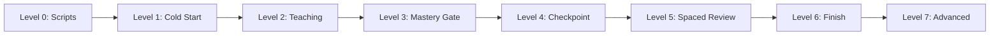
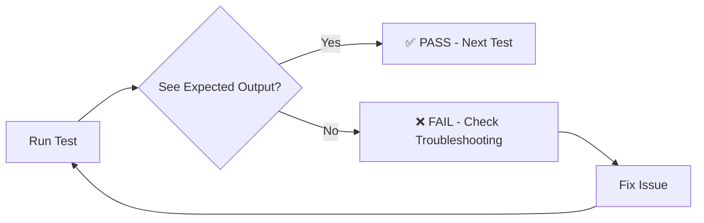
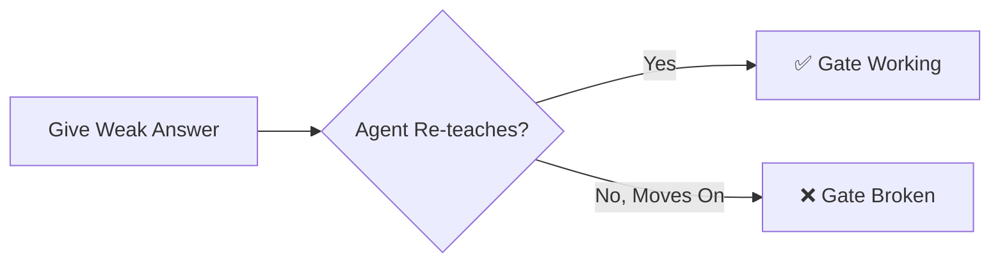

# 🧪 Agent Factory — Complete Testing Guide

> **Who this is for**: You. A solo user who built something real and wants to know it actually works — from the Python scripts all the way to a full learning session with HTML output.
>
> **How long does this take?** Run everything once: about 90 minutes total. Each individual test takes 1–3 minutes.
>
> **You don't need testing experience.** Every test tells you exactly what to do, what to look for, and whether you passed or failed.

---

## 🗺️ Testing Flow Overview



Each level builds on the one before. Do them in order the first time you run this guide.

---

## ✅ How to Read Each Test



Every test has three parts:
- **WHAT TO DO** — exact command or chat message to send
- **WHAT YOU SHOULD SEE** — exactly what success looks like
- **PASS / FAIL criteria** — no guessing required

---

## 🛫 Section 1: Before You Start — Pre-flight Checks

Run these checks once before any testing. They confirm your environment is ready. If any check fails, fix it before moving on — the Claude-level tests depend on these working.

All commands run from the repo root:

```bash
cd /root/code/Agent-Factory-Mastery-Lab/.claude/worktrees/updating-stuff
```

---

### Check 1: Python scripts work

```bash
python3 scripts/health-check.py
```

**What you should see:**
```
✅ HEALTHY — All 3 checks passed.
```

> ✅ PASS: You see the HEALTHY line with all 3 checks passed.
> ❌ FAIL: You see UNHEALTHY or a Python error.

**If UNHEALTHY**, the script will tell you which check failed. The three checks are:
1. `status.json` exists and has the required fields
2. `master-cumulative.md` exists and has all 18 sections
3. No orphaned `.tmp` files in `context-bridge/`

Fix each one individually before moving on.

---

### Check 2: status.json exists and is valid

```bash
cat context-bridge/status.json
```

**What you should see** — valid JSON with these exact fields:
```json
{
  "lesson": "none",
  "layer": "none",
  "concept": "none",
  "last_checkpoint": "never",
  "message_count_since_checkpoint": 0,
  "session_count": 0,
  "status": "fresh_start",
  "next_review_due_count": 0,
  "last_updated": "2026-03-29"
}
```

> ✅ PASS: File exists, opens as valid JSON, contains all the fields above.
> ❌ FAIL: `No such file`, `JSONDecodeError`, or missing fields like `session_count`.

---

### Check 3: session-start.py runs

```bash
python3 scripts/session-start.py
```

**What you should see:** JSON output containing a `banner` field with formatted text.

> ✅ PASS: JSON is printed with a `banner` key and text inside it.
> ❌ FAIL: Python error, empty output, or output is not valid JSON.

---

### Check 4: Jinja2 is installed

```bash
python3 -c "import jinja2; print('jinja2 OK:', jinja2.__version__)"
```

**What you should see:**
```
jinja2 OK: 3.x.x
```

> ✅ PASS: Version number prints.
> ❌ FAIL: `ModuleNotFoundError: No module named 'jinja2'`

**Fix:** `pip install jinja2`

---

### Check 5: HTML generation works

```bash
python3 scripts/generate-html.py --demo
```

**What you should see:**
```
✅ HTML generated: visual-presentations/demo-lesson-3.1-hook-architecture.html
```

Then open that file in a browser. You should see 8 slides with forward/back navigation.

> ✅ PASS: File created AND the browser shows slides you can navigate.
> ❌ FAIL: Script errors out OR file is created but browser shows a blank/broken page.

---

### Check 6: Index generation works

```bash
python3 scripts/generate-index.py
```

**What you should see:**
```
✅ INDEX.html generated
```

> ✅ PASS: `INDEX.html` appears in `visual-presentations/`.
> ❌ FAIL: Error or no file created.

---

All six pre-flight checks passing? Great — you're ready to test.

---

## 🔧 Section 2: Level 0 — Script Tests (No Claude Needed)

These tests run the Python scripts directly. Claude is not involved at all. This level proves your tooling layer works before you trust it to be called from inside a session.

---

### Test 0.1: Atomic write — backup action

```bash
python3 scripts/checkpoint-write.py --action backup
```

**What you should see:**
```
✅ Bridge backed up to: context-bridge/backup/master-cumulative-YYYY-MM-DD-HHMM.md
```

Then confirm the file was actually created:
```bash
ls context-bridge/backup/
```

> ✅ PASS: Backup file appears with today's date in the filename.
> ❌ FAIL: Error OR `ls` shows an empty directory.

---

### Test 0.2: Status update via script

```bash
python3 scripts/checkpoint-write.py --action update-status --lesson 3.1 --layer L1 --concept "Test Concept"
cat context-bridge/status.json
```

**What you should see** in the JSON output:
```json
{
  "lesson": "3.1",
  "layer": "L1",
  "concept": "Test Concept",
  ...
}
```

> ✅ PASS: All three fields (lesson, layer, concept) show the values you set.
> ❌ FAIL: Values unchanged, file missing, or JSON error.

---

### Test 0.3: Bridge section append

```bash
python3 scripts/bridge-update.py --section 17 --content "| TEST | 2026-03-29 | none | 0 | test row |"
grep "TEST" context-bridge/master-cumulative.md
```

**What you should see:**
```
| TEST | 2026-03-29 | none | 0 | test row |
```

> ✅ PASS: The grep finds your row in the bridge file.
> ❌ FAIL: No output (row not written) or script error.

---

### Test 0.4: Idempotency — same row written twice

This tests that the bridge guard prevents duplicate rows. Write the same row twice:

```bash
python3 scripts/bridge-update.py --section 17 --content "| DUPLICATE | 2026-03-29 | none | 0 | test |"
python3 scripts/bridge-update.py --section 17 --content "| DUPLICATE | 2026-03-29 | none | 0 | test |"
grep -c "DUPLICATE" context-bridge/master-cumulative.md
```

**What you should see:**
```
1
```

> ✅ PASS: Count is `1` — the row only appears once despite being written twice.
> ❌ FAIL: Count is `2` or higher — idempotency guard is broken.

**Why this matters:** Without this guard, every checkpoint in a long session would double-write entries and corrupt the bridge.

---

### Test 0.5: Banner content is readable

```bash
python3 scripts/session-start.py | python3 -c "import json,sys; d=json.load(sys.stdin); print(d['banner'])"
```

**What you should see:** A formatted multi-line recovery banner with fields like session count, last lesson, health status.

> ✅ PASS: The banner text prints cleanly with recognizable fields.
> ❌ FAIL: `KeyError: 'banner'`, blank output, or JSON parse error.

---

### Test 0.6: Reset status.json for clean testing

Before moving to Level 1, reset to a fresh state so Level 1 tests are predictable:

```bash
python3 -c "
import json
data = {
  'lesson': 'none',
  'layer': 'none',
  'concept': 'none',
  'last_checkpoint': 'never',
  'message_count_since_checkpoint': 0,
  'session_count': 0,
  'status': 'fresh_start',
  'next_review_due_count': 0,
  'last_updated': '2026-03-29'
}
open('context-bridge/status.json', 'w').write(json.dumps(data, indent=2))
print('Reset done')
"
```

**What you should see:**
```
Reset done
```

> ✅ PASS: `Reset done` prints. `cat context-bridge/status.json` shows `"status": "fresh_start"`.
> ❌ FAIL: Permission error or file not reset.

---

**Level 0 complete.** All scripts work. Now test the actual Claude session.

---

## 🚀 Section 3: Level 1 — Cold Start Recovery

Open Claude Code in the repo directory. These tests verify what happens before you type anything — the cold-start recovery protocol that runs automatically on every session start.

```bash
# Open Claude Code from the repo root
cd /root/code/Agent-Factory-Mastery-Lab/.claude/worktrees/updating-stuff
claude
```

---

### Test 1.1: Fresh start detection

Open Claude Code and **wait**. Do not type anything. Watch the first response.

**What you should see:** A recovery banner OR a greeting that explicitly mentions this is a fresh start with no prior lessons.

> ✅ PASS: Agent mentions the system, shows health status, and acknowledges it's a fresh start.
> ❌ FAIL: Agent says something generic like "Hello! How can I help you today?" with no mention of the tutoring system.

---

### Test 1.2: Health check runs on session start

Look at the first message from the agent (same as 1.1 — just check a different part of it).

**What you should see:** Somewhere in the greeting you see either `✅ HEALTHY` or `⚠️ UNHEALTHY`.

> ✅ PASS: One of those two phrases appears.
> ❌ FAIL: No health mention at all. Agent just greets you without running the check.

---

### Test 1.3: Agent reads correct status

Type this in Claude:

> `What lesson are we on and what's my current status?`

**What you should see:** Agent reports the values from `status.json` — should say something like "no lessons started yet" or "fresh start" with lesson=none.

> ✅ PASS: Agent reports the actual status.json values. Says we haven't started any lessons.
> ❌ FAIL: Agent makes up a lesson name, says "I don't have access to that information", or contradicts what's in status.json.

---

## 📚 Section 4: Level 2 — Basic Teaching Session

These tests verify the TEACH cycle format. Every concept taught in this system must follow T→E→A→C→H in order. You're checking that all five steps actually happen.

Type this in Claude:

> `Teach me the first concept in Chapter 1`

Then watch carefully as the response arrives.

---

### Test 2.1: TEACH cycle starts with vocabulary (T step)

**What you should see:** The very first thing in the lesson is a vocabulary table or vocabulary section. It defines every term that will be used — before using them.

> ✅ PASS: You see a table or list labeled something like "Key Vocabulary", "Terms", or "Before We Start" — with definitions — before any explanation begins.
> ❌ FAIL: Agent jumps straight into explaining without defining terms first.

---

### Test 2.2: Vocabulary gate — no undefined terms in explanation (E step)

Read through the explanation section. Check whether every technical term the agent uses was already in the vocabulary table.

**What you should see:** Every term in the explanation section appeared first in the vocabulary table.

> ✅ PASS: No surprise jargon. Everything in the explanation was pre-defined.
> ❌ FAIL: Agent uses a term in the explanation (e.g., "orchestration loop") that was never defined in the vocabulary section.

---

### Test 2.3: Analogy provided (A step)

After the explanation, the agent should give you a real-world comparison.

**What you should see:** A phrase like "think of it like...", "imagine you're a...", or a simple ASCII diagram / comparison table.

> ✅ PASS: A concrete analogy or visual appears. Something that maps the abstract concept to something familiar.
> ❌ FAIL: More explanation paragraphs with no analogy or visualization of any kind.

---

### Test 2.4: Check Understanding question is open-ended (C step)

The agent should pause and ask you a question before moving on.

**What you should see:** A question that requires you to explain, apply, or analyze something. Not a yes/no question.

> ✅ PASS: The question starts with something like "How would you...", "What would happen if...", "Describe in your own words...", or "Why does..."
> ❌ FAIL: Agent asks "Did you understand?" or "Does that make sense?" or "Ready to continue?" — those are yes/no questions that don't check anything.

---

### Test 2.5: Hands-on exercise provided (H step)

After you answer the C-step question, the agent should give you something to actually do.

Type any reasonable answer to the question (you don't need to be right — just respond). Then check the follow-up.

**What you should see:** A specific exercise with instructions and an expected output. Something like "run this command", "write this pseudocode", "trace through this scenario".

> ✅ PASS: A concrete task with a described expected outcome appears.
> ❌ FAIL: Agent moves to the next concept without offering any exercise.

---

## 🚦 Section 5: Level 3 — Mastery Gate

This is the most critical test in the entire guide. The mastery gate is what separates this system from a regular chatbot. It must block forward progress until the student demonstrates genuine understanding.



---

### Test 3.1: Weak answer blocks progress

When the agent asks the Check Understanding question, give this deliberately weak answer:

> `I don't really know, I'm not sure about this`

**What you should see:** Agent does NOT move on to the next concept. Instead it re-teaches the same concept using a different approach — a different analogy, a different entry point, or a simpler breakdown. Then asks a new question.

> ✅ PASS: Agent says something like "Let me try a different angle on this..." and re-explains before asking again.
> ❌ FAIL: Agent accepts your non-answer and starts teaching the next concept. The gate is broken.

---

### Test 3.2: Verbatim recitation is caught

When the agent asks again (after re-teaching), copy the exact definition it gave you and repeat it back word-for-word.

> [literally copy-paste what the agent told you and send it]

**What you should see:** Agent recognizes this as rote repetition (not genuine understanding) and prompts you to explain in your own words or provide a concrete example.

> ✅ PASS: Agent says something like "That's the definition I gave you — can you put it in your own words?" or "Give me an example."
> ❌ FAIL: Agent accepts verbatim recitation as evidence of understanding and proceeds.

---

### Test 3.3: Three-failure loop cap

Give weak or wrong answers three times in a row on the same concept. On the third failure:

**What you should see:** Agent flags the concept with ⚠️ NEEDS REVIEW, acknowledges the difficulty, and then CONTINUES to the next concept rather than looping forever.

> ✅ PASS: After exactly 3 failures, agent marks the concept and moves forward. It does not loop a 4th time.
> ❌ FAIL: Agent loops endlessly (never stops) OR gives up immediately after the first wrong answer without trying twice more.

---

### Test 3.4: Good answer unlocks progress

Give a solid answer in your own words with a concrete example. Something like:

> `So it's like [your own analogy here]. In practice that means [your own example].`

**What you should see:** Agent confirms mastery, marks the TEACH cycle as complete, and proceeds to the hands-on exercise.

> ✅ PASS: Agent explicitly acknowledges the good answer, marks completion, and gives the exercise.
> ❌ FAIL: Nothing changes — agent re-asks or moves on without acknowledging the answer quality.

---

## 💾 Section 6: Level 4 — Checkpoint & Recovery

After completing at least one TEACH cycle (mastery gate passed + exercise), test the checkpoint system.

---

### Test 4.1: Checkpoint command is recognized

Type in Claude:

> `Checkpoint`

**What you should see:** Agent acknowledges the checkpoint command, runs the synthesis, creates a file in `revision-notes/`, and updates `context-bridge/master-cumulative.md`. You should see a confirmation like "Checkpoint L1 complete."

> ✅ PASS: Agent acknowledges Checkpoint, creates files, and confirms completion with a layer number.
> ❌ FAIL: Agent asks "what do you mean by checkpoint?", does nothing, or just summarizes without creating files.

---

### Test 4.2: Health check passes after checkpoint

After the agent confirms the checkpoint:

```bash
python3 scripts/health-check.py
```

**What you should see:**
```
✅ HEALTHY — All 3 checks passed.
```

> ✅ PASS: Still HEALTHY.
> ❌ FAIL: UNHEALTHY — something the checkpoint did corrupted or truncated the bridge.

Then also check:

```bash
cat context-bridge/status.json
```

> ✅ PASS: `lesson`, `layer`, and `concept` fields are updated with what you just learned (not "none").
> ❌ FAIL: Still shows `"lesson": "none"` or stale values from Test 0.6.

---

### Test 4.3: Backup file was created

```bash
ls context-bridge/backup/
```

**What you should see:** A file named `master-cumulative-YYYY-MM-DD-HHMM.md` with today's date.

> ✅ PASS: Dated backup file exists.
> ❌ FAIL: Directory is empty or only has the test backup from Test 0.1.

---

### Test 4.4: Close and reopen — recovery works

Close Claude Code completely. Open a brand new session.

```bash
claude
```

Wait for the first message without typing anything.

**What you should see:** A recovery banner showing the lesson, layer, and concept you checkpointed. The agent offers to continue from where you left off.

> ✅ PASS: Banner shows correct lesson/layer/concept from your checkpoint. Agent knows exactly where you were.
> ❌ FAIL: Agent starts fresh with no mention of prior progress OR shows wrong lesson/concept.

---

### Test 4.5: Banner reflects checkpoint via script

Close Claude. Run this from the terminal:

```bash
python3 scripts/session-start.py | python3 -c "import json,sys; d=json.load(sys.stdin); print(d['banner'])"
```

**What you should see:** A banner that shows the correct lesson and layer from your checkpoint — not "none" or "fresh_start".

> ✅ PASS: Banner references your actual checkpoint lesson and layer.
> ❌ FAIL: Banner says "none" or the lesson from Test 0.2 (which was a fake "3.1" — should show what you actually learned).

---

## 🔁 Section 7: Level 5 — Spaced Review

These tests require having completed at least one TEACH cycle and checkpoint. They verify the retention system — concepts are surfaced for review on a schedule, not just taught once and forgotten.

---

### Test 5.1: Vocabulary bank has entries

After a checkpoint:

```bash
grep -A 5 "## 7\." context-bridge/master-cumulative.md
```

**What you should see:** Section 7 (Vocabulary Bank) contains a table with at least one row per term you learned. The table should have columns including `LastReview`, `NextReviewDue`, and `Interval`.

> ✅ PASS: Table has at least one data row (not just the header) with those columns populated.
> ❌ FAIL: Table is empty, section is missing, or only has a header row.

---

### Test 5.2: Pre-lesson retrieval fires on new session

Open a completely new Claude session (after having done at least one lesson and checkpoint). Do not type anything. Wait for the agent's full greeting to complete.

**What you should see:** Before the agent offers to teach anything new, it asks you 1–5 cold recall questions from your vocabulary bank. These are no-context questions like "Without looking it up — what is [term]?"

> ✅ PASS: Retrieval questions appear before any new teaching content. They have no hints.
> ❌ FAIL: Agent skips retrieval entirely and jumps straight to "Ready to continue Lesson X?"

---

### Test 5.3: Scaffold fading across lessons (requires 2+ lessons done)

Complete two full lessons and checkpoint after each one. Then start a third lesson.

When the third lesson begins, check whether terms from Lesson 1 appear in a vocabulary table.

**What you should see:** Terms from Lesson 1 are NOT re-defined in a vocabulary table. Instead, the agent references them with something like "recall from Lesson 1.1 — what does X mean?" rather than defining them again.

> ✅ PASS: Agent treats Lesson 1 terms as known and asks for recall rather than re-teaching them.
> ❌ FAIL: Lesson 1 terms appear in a fresh vocabulary table as if you've never seen them before.

---

## 🏁 Section 8: Level 6 — Finish & Artifact Generation

This tests the full end-of-lesson synthesis — everything that gets generated when you mark a lesson complete.

---

### Test 6.1: Finish shows a confirmation dialog

Type in Claude:

> `Finish`

**What you should see:** Agent shows a confirmation dialog listing everything it's about to generate (HTML presentation, cheatsheet, flashcards) and explicitly asks you to type YES to proceed.

> ✅ PASS: A clear "Are you sure?" style dialog appears. Agent does not start generating anything yet.
> ❌ FAIL: Agent immediately starts synthesis without asking. No confirmation gate.

---

### Test 6.2: Typing YES generates all three artifact types

Type YES when prompted. Then check:

```bash
ls visual-presentations/
ls quick-reference/
ls flashcards/
```

**What you should see:**
- At least one `.html` file in `visual-presentations/`
- At least one `.md` file in `quick-reference/`
- At least one `.json` file in `flashcards/`

> ✅ PASS: All three directories have new files.
> ❌ FAIL: Any directory is still empty after YES was typed.

---

### Test 6.3: HTML presentation is well-formed and navigable

```bash
python3 scripts/generate-index.py
```

Open `visual-presentations/INDEX.html` in a browser.

**What you should see:** A page that loads properly, shows lesson cards, and clicking a card opens a presentation. Inside the presentation, arrow keys navigate between slides.

> ✅ PASS: Page loads, cards are visible, clicking works, arrow navigation works.
> ❌ FAIL: Blank page, broken layout, cards don't click through, slides don't navigate.

---

### Test 6.4: Flashcard JSON has Anki-compatible fields

```bash
python3 -c "
import json, glob
files = glob.glob('flashcards/*.json')
if files:
    cards = json.load(open(files[0]))
    card = cards[0] if isinstance(cards, list) else list(cards.values())[0]
    print('Fields found:', list(card.keys()))
else:
    print('No flashcard files found')
"
```

**What you should see:**
```
Fields found: ['front', 'back', 'ease_factor', 'interval_days', 'next_review', 'bloom_level', ...]
```

> ✅ PASS: Fields include `ease_factor`, `interval_days`, `next_review`, and `bloom_level`.
> ❌ FAIL: Only `front` and `back` — missing the Anki scheduling fields that make spaced repetition work.

---

## ⚡ Section 9: Level 7 — Advanced Tests

These tests cover edge cases, safety gates, and system resilience. They require having completed at least Levels 4–6 first.

---

### Test 7.1: Rewind has a confirmation gate

Type in Claude:

> `Rewind`

Select a checkpoint layer when prompted. Before it executes, look for a confirmation prompt.

**What you should see:** Agent shows a warning that this is a destructive action (will roll back state) and asks you to type CONFIRM before proceeding.

> ✅ PASS: CONFIRM gate appears. Rewind does not execute until you type CONFIRM.
> ❌ FAIL: Rewind executes immediately after you select a layer, no CONFIRM step.

---

### Test 7.2: Chapter Assessment fires on chapter completion

This test requires finishing all lessons in a single chapter (e.g., Chapter 1) and typing `Finish` on the last one.

**What you should see:** After the regular Finish synthesis, agent announces a Chapter Assessment. It presents a scenario or problem with NO hints about which concepts apply — you have to identify them yourself.

> ✅ PASS: Chapter Assessment appears before the chapter is marked complete. No concept hints given.
> ❌ FAIL: Chapter is marked complete without any assessment. Or assessment includes hints like "this relates to [concept name]."

---

### Test 7.3: Profile evolution after sustained mastery

After consistently passing mastery gate checks across multiple concepts (at L2 rubric level), start a new lesson and observe the scaffolding level.

**What you should see:** Agent reduces vocabulary table scaffolding, mentions reaching a milestone, and starts asking you to generate analogies rather than providing them.

> ✅ PASS: Scaffolding visibly reduces. Agent treats you differently than it did in Level 2 testing.
> ❌ FAIL: Same full vocabulary table, same guided format regardless of how much you've demonstrated mastery.

---

### Test 7.4: Auto-Verify runs before Finish generates artifacts

Type `Finish` in a session. After you type YES, watch what happens before the HTML is generated.

**What you should see:** Before generating any artifacts, agent runs a coverage check. It either confirms "✅ Full coverage — all lesson concepts addressed" or shows a list of gaps with options for what to do.

> ✅ PASS: Coverage check output appears before the "Generating HTML..." step.
> ❌ FAIL: Agent jumps straight to generating HTML with no coverage check.

---

### Test 7.5: Atomic write failure is detected and logged

This test simulates a write failure to verify the system notices and logs it:

```bash
chmod 444 context-bridge/master-cumulative.md
python3 scripts/checkpoint-write.py --action backup
chmod 644 context-bridge/master-cumulative.md
cat context-bridge/status.json | python3 -c "import json,sys; d=json.load(sys.stdin); print('repair_needed:', d.get('repair_needed', False))"
```

**What you should see:**
```
repair_needed: True
```

> ✅ PASS: `repair_needed: True` — the system caught the failure and logged it in status.json.
> ❌ FAIL: `repair_needed: False` — failure happened silently with no record.

**Cleanup after this test:**
```bash
chmod 644 context-bridge/master-cumulative.md
python3 -c "
import json
d = json.load(open('context-bridge/status.json'))
d['repair_needed'] = False
open('context-bridge/status.json', 'w').write(json.dumps(d, indent=2))
print('Cleaned up')
"
```

---

## 📋 Section 10: Quick Test Checklist

Use this when you want to verify the system is working without going through every detail. Run through the full guide once first, then use this for quick re-verification.

```
LEVEL 0 — Scripts
[ ] health-check.py → ✅ HEALTHY
[ ] checkpoint-write.py backup → creates dated file in backup/
[ ] checkpoint-write.py update-status → status.json fields updated
[ ] bridge-update.py → new row appears in section 17
[ ] bridge-update.py duplicate → grep -c shows only 1 row (idempotent)
[ ] session-start.py → banner field present in JSON output
[ ] generate-html.py --demo → HTML file created, opens in browser
[ ] generate-index.py → INDEX.html created

LEVEL 1 — Cold Start
[ ] Fresh session shows recovery banner (or fresh start notice)
[ ] Health status (HEALTHY/UNHEALTHY) shown in greeting
[ ] Agent correctly reads status.json and reports actual values

LEVEL 2 — Teaching
[ ] TEACH cycle starts with vocabulary table (T step first)
[ ] Vocabulary gate: no undefined terms used before being defined
[ ] Analogy or visualization provided (A step)
[ ] Check Understanding question is open-ended, not yes/no (C step)
[ ] Hands-on exercise given after answering question (H step)

LEVEL 3 — Mastery Gate
[ ] Weak answer → agent re-teaches with different approach (not moves on)
[ ] Verbatim recitation → prompted for own words or example
[ ] 3 failures → ⚠️ flag + continues (not infinite loop)
[ ] Good own-words answer → TEACH cycle marked complete + exercise

LEVEL 4 — Checkpoint & Recovery
[ ] Checkpoint command → acknowledged + files created
[ ] health-check.py after checkpoint → still HEALTHY
[ ] status.json updated with real lesson/layer/concept
[ ] backup/ directory has dated backup file
[ ] Close + reopen session → correct recovery banner

LEVEL 5 — Spaced Review
[ ] Vocabulary bank in section 7 has data rows after lesson
[ ] New session → pre-lesson retrieval fires before new content
[ ] Lesson 3+ → Lesson 1 terms recalled, not re-defined

LEVEL 6 — Finish & Artifacts
[ ] Finish → confirmation dialog appears before generation
[ ] YES → HTML file in visual-presentations/
[ ] YES → markdown in quick-reference/
[ ] YES → JSON in flashcards/
[ ] INDEX.html loads and slides navigate with arrow keys
[ ] Flashcard JSON has ease_factor, interval_days, next_review, bloom_level

LEVEL 7 — Advanced
[ ] Rewind → CONFIRM gate shown before execution
[ ] Chapter final Finish → Chapter Assessment fires, no hints
[ ] Profile evolves after L2 milestones (reduced scaffolding)
[ ] Auto-Verify runs before HTML generation on Finish
[ ] chmod 444 test → repair_needed: True in status.json
```

---

## 🔧 Section 11: Troubleshooting Common Issues

| Symptom | Likely Cause | Fix |
|---------|-------------|-----|
| `health-check.py` shows missing sections | Bridge file incomplete or truncated | Run `python3 scripts/health-check.py` for details, then type `Repair` in a Claude session |
| Recovery banner shows wrong lesson | status.json has stale data | `python3 scripts/checkpoint-write.py --action update-status --lesson X --layer Y --concept "Z"` |
| `generate-html.py` fails with `ImportError` | Jinja2 not installed | `pip install jinja2` |
| Checkpoint runs but status.json not updated | Script not being invoked by agent | Check CLAUDE.md Script Support section — agent may need to be reminded to use scripts |
| Pre-lesson retrieval never fires | Vocabulary bank is empty | Complete one full TEACH cycle and checkpoint first — retrieval needs terms to surface |
| `repair_needed` stays False after write failure | status.json write also failed (double failure) | Manually set it: `python3 -c "import json; d=json.load(open('context-bridge/status.json')); d['repair_needed']=True; open('context-bridge/status.json','w').write(json.dumps(d))"` |
| HTML opens but slides don't navigate | Browser security blocking local JS | Open with `python3 -m http.server` and access via `localhost` instead of file:// |
| Backup directory empty after checkpoint | Script path issue or permissions | Check `ls -la context-bridge/backup/` and verify script was called with `--action backup` |
| Agent loops more than 3 times on mastery gate | CLAUDE.md loop counter not being tracked | This is a behavioral rule — report it as a bug; the constraint is in CLAUDE.md BEHAVIORAL CONSTRAINTS |
| Duplicate rows appearing in bridge | Idempotency guard not firing | Run Test 0.4 to confirm — if it fails, `bridge-update.py` checksum logic needs investigation |

---

## 📊 Section 12: Audit Scorecard

After running the full guide, record your results here. Run this audit again after any system change.

| Date | Level | Tests Run | Tests Passed | Notes |
|------|-------|-----------|--------------|-------|
| 2026-03-29 | 0 (Scripts) | 6 | _/6 | |
| 2026-03-29 | 1 (Cold Start) | 3 | _/3 | |
| 2026-03-29 | 2 (Teaching) | 5 | _/5 | |
| 2026-03-29 | 3 (Mastery Gate) | 4 | _/4 | |
| 2026-03-29 | 4 (Checkpoint) | 5 | _/5 | |
| 2026-03-29 | 5 (Spaced Review) | 3 | _/3 | |
| 2026-03-29 | 6 (Finish) | 4 | _/4 | |
| 2026-03-29 | 7 (Advanced) | 5 | _/5 | |
| **TOTAL** | | **35** | **/35** | |

**Scoring:**
- 35/35 — System is fully operational. All features working as designed.
- 30–34 — Mostly working. Fix the failures, re-run just those tests.
- 25–29 — Significant gaps. One or more features need debugging before trusting.
- Below 25 — Run `python3 scripts/health-check.py` and start from the failures it surfaces.
