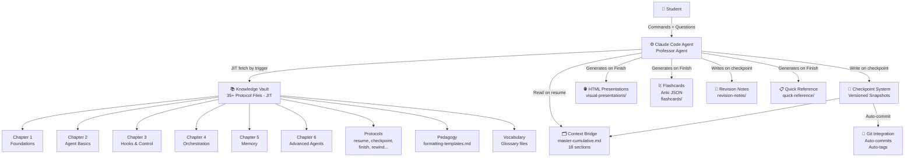
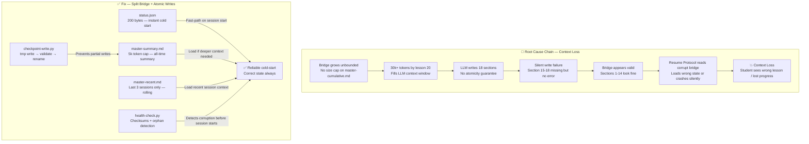
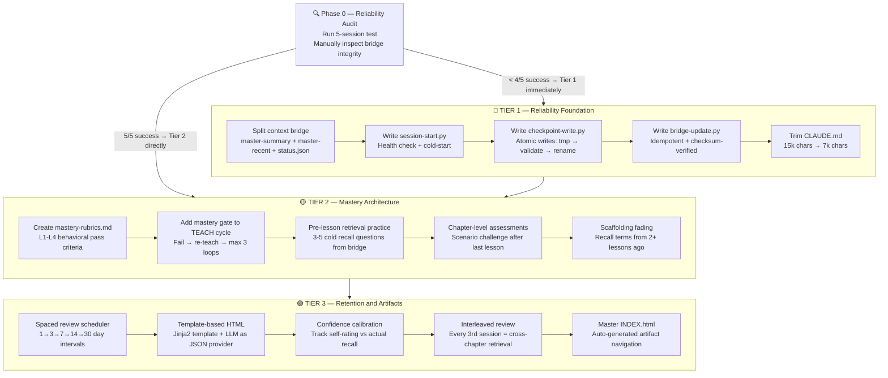
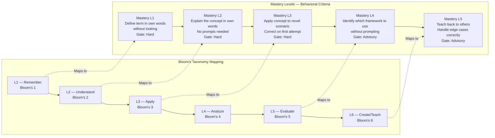
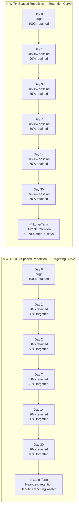
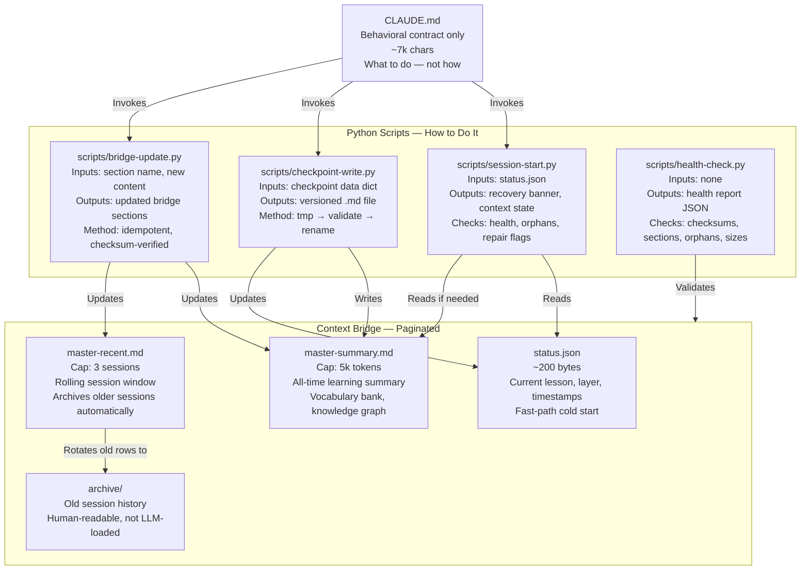
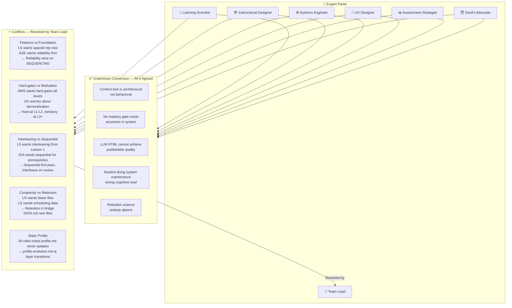
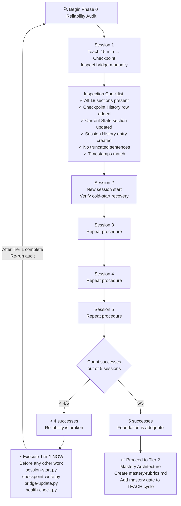

# 🧠 World-Class Teaching System Analysis
## OMNI-EXPERT INTERROGATION PROTOCOL — Agent Factory AI Tutor

> **Document Type**: Multi-Expert Technical Design Analysis
> **Subject**: Agent Factory Part 1 — Elite AI Tutoring System (Claude Code)
> **Course**: Panaversity AIAF-2026 "Agent Factory Part 1: General Agents Foundations"
> **Analysis Date**: 2026-03-29
> **Status**: Comprehensive Audit Complete — Transformation Roadmap Ready

---

## 📋 Table of Contents

1. [System Overview](#1-system-overview)
2. [Expert Panel Introduction](#2-expert-panel)
3. [The 5 Core Problems Found](#3-the-5-core-problems)
   - [Problem 1: Context Loss](#problem-1-context-loss-technical-)
   - [Problem 2: No Mastery Gate](#problem-2-no-mastery-gate-pedagogical-)
   - [Problem 3: No Retention Mechanics](#problem-3-no-retention-mechanics-neuroscience-)
   - [Problem 4: Student Does System Maintenance](#problem-4-student-does-system-maintenance-ux-)
   - [Problem 5: Assessment Measures Recognition Not Mastery](#problem-5-assessment-measures-recognition-not-mastery-assessment-)
4. [The Three-Tier Transformation Roadmap](#4-the-three-tier-transformation-roadmap)
5. [Consensus Points](#5-consensus-points)
6. [Role Conflicts and Resolutions](#6-role-conflicts--resolutions)
7. [The Reliability Audit — Phase 0](#7-the-reliability-audit--phase-0)
8. [The 17-Step Implementation Plan](#8-the-17-step-implementation-plan)
9. [Critical Assumptions](#9-critical-assumptions)
10. [Edge Cases and Failure Map](#10-edge-cases--failure-map)
11. [Mermaid Diagrams](#11-mermaid-diagrams)

---

## 1. System Overview

The **Agent Factory AI Tutor** is a Claude Code-based elite tutoring system built for the Panaversity course *"Agent Factory Part 1: General Agents Foundations"* (AIAF-2026). It acts as a personal Professor Agent combining domain expertise, master teaching methodology, and exam coaching.

### Core Architecture at a Glance

| Component | Description | Files/Location |
|-----------|-------------|----------------|
| **TEACH Cycle** | 5-phase pedagogical loop | Defined in CLAUDE.md |
| **Knowledge Vault** | 35+ protocol files loaded JIT | `Knowledge_Vault/` |
| **Context Bridge** | 18-section living document | `context-bridge/master-cumulative.md` |
| **Checkpoint System** | Versioned progress snapshots | `context-bridge/snapshots/` |
| **HTML Presentations** | LLM-generated slide decks | `visual-presentations/` |
| **Flashcards** | Anki-compatible JSON decks | `flashcards/` |
| **Git Integration** | Auto-commits on checkpoint | `.git/hooks/` |

### The TEACH Cycle

```
T — Terminology First    → Define every term before use
E — Explain with Depth   → What / Why / How / Where / What can go wrong
A — Analogize            → Real-world analogies, ASCII diagrams, tables
C — Check Understanding  → Open-ended questions, wait for response
H — Hands-On Practice    → Immediately executable exercises with outcomes
```

### The 12 Student Commands

| Command | Purpose | Risk Level |
|---------|---------|-----------|
| `Checkpoint` | Save progress, continue teaching | 🟡 Medium |
| `Finish` | End lesson with full synthesis | 🔴 High (triggers 6-tier output) |
| `Rewind` | Roll back to previous checkpoint | 🔴 High (destructive) |
| `Verify` | Check curriculum coverage | 🟢 Low |
| `Resume` | Load bridge and continue | 🟡 Medium |
| `Repair` | Fix incomplete checkpoint metadata | 🟡 Medium |
| `Sync` | Discover new curriculum lessons | 🟢 Low |
| `Review {X.Y}` | Quiz on completed lesson | 🟢 Low |
| `Compare` | Diff checkpoints/curriculum/notes | 🟢 Low |
| `Export {X.Y}` | Bundle lesson for sharing | 🟢 Low |
| `Status` | Progress dashboard | 🟢 Low |
| `End` | Alias for `Finish` | 🔴 High |

### Knowledge Vault Structure

```
Knowledge_Vault/
├── 00-VAULT-INDEX.md          ← Routing manifest
├── Curriculum/
│   ├── chapter-1-*.md
│   ├── chapter-2-*.md
│   └── ... (6 chapters total)
├── Protocols/
│   ├── resume-protocol.md
│   ├── checkpoint-synthesis.md
│   ├── finish-synthesis.md
│   ├── end-of-session-synthesis.md
│   └── ... (12+ protocol files)
├── Pedagogy/
│   └── formatting-templates.md
├── Vocabulary/
│   └── *.md
├── Frameworks/
│   ├── checkpoint-readiness-signals.md
│   └── *.md
├── Assessment/          ← MISSING (identified gap)
├── Student/
│   └── profile.md
└── Capabilities/
    └── rules-and-constraints.md
```

---

## 2. Expert Panel

The following six expert roles conducted an independent interrogation of the system, followed by a Team Lead synthesis:

| # | Role | Focus Area | Primary Concern |
|---|------|-----------|----------------|
| **1** | 🧪 Learning Scientist | Cognitive load, memory, neuroscience | Retention mechanics entirely absent |
| **2** | 🏗️ Instructional Design Architect | Curriculum structure, scaffolding | No mastery gate in TEACH cycle |
| **3** | ⚙️ AI Systems Engineer | Reliability, file I/O, determinism | Context loss is architectural failure |
| **4** | 🎨 UX & Flow Designer | Student experience, cognitive load | Student doing system maintenance |
| **5** | 📊 Assessment & Mastery Strategist | Measurement, Bloom's Taxonomy | Measuring recognition not mastery |
| **6** | 😈 Devil's Advocate | Stress-testing, failure modes | All problems compound each other |
| **7** | 🎯 Team Lead | Synthesis, prioritization | Sequencing the transformation |

> **Protocol Note**: Each role interrogated the system independently before cross-role debate. No consensus was pre-arranged. All conflicts were resolved through structured deliberation documented in Section 6.

---

## 3. The 5 Core Problems

### Problem 1: Context Loss 🔴 Technical

> **Severity**: CRITICAL — This is not a bug, it is an architectural failure mode baked into the design.

**Root Cause**: The `context-bridge/master-cumulative.md` file is an 18-section living document written entirely by the LLM with no atomicity guarantees, no checksums, and no size cap.

#### Failure Chain

| Stage | What Happens | Result |
|-------|-------------|--------|
| Lessons 1-5 | Bridge grows normally | Works fine |
| Lessons 10-15 | Bridge reaches ~15,000 tokens | Writes begin taking LLM context space away from teaching |
| Lessons 20+ | Bridge reaches 30,000+ tokens | LLM context window fills; sections written incompletely |
| Silent corruption | LLM "thinks" it wrote correctly | No error raised; corrupted bridge persists |
| Next session | Resume protocol reads corrupted bridge | Cold-start recovery fails or shows wrong state |
| Student sees | "Checkpoint saved!" but data is missing | Lost progress, broken continuity |

#### Technical Details

- **Bridge growth rate**: ~1,500 tokens per lesson × 20 lessons = 30,000+ tokens
- **LLM write mechanism**: Multi-stage markdown write with no `tmp → validate → rename` atomicity
- **JIT trigger detection**: Pattern-matched against user message — probabilistic, not deterministic
- **Health check on session start**: **Does not exist**
- **Corruption detection**: **Does not exist**

#### What "Silent Corruption" Looks Like

```markdown
## 14. Checkpoint History
| Layer | Timestamp | Concepts Covered | File | Status |
|-------|-----------|------------------|------|--------|
| L1 | 2026-03-15 | Hook architecture | 3.17-L1... | ✓ Archived |
<!-- LLM ran out of context here — sections 15-18 missing -->
```

The file looks valid from section 1-14 but sections 15-18 are missing. The Resume Protocol reads it, finds section 15 missing, and either crashes silently or loads wrong state.

---

### Problem 2: No Mastery Gate 🔴 Pedagogical

> **Severity**: CRITICAL — Teaching without verifying comprehension is not teaching; it is broadcasting.

**Root Cause**: The TEACH cycle's "Check Understanding" (C) phase asks a question but has no logic for what to do with the answer. There is no pass/fail threshold, no re-teach loop, and no definition of "mastery."

#### Current vs. Required TEACH Cycle

| Phase | Current Behavior | Required Behavior |
|-------|-----------------|------------------|
| C — Check | Asks one open-ended question | Evaluates response against mastery rubric |
| Gate | **Does not exist** | Pass → proceed to H; Fail → re-teach |
| Re-teach | **Does not exist** | Different approach, max 3 loops |
| Escalation | **Does not exist** | After 3 fails: flag, note in bridge, continue |
| Bloom's Level | Asked at L6 before L1-4 verified | L1-4 verified before L5-6 attempted |

#### The Mastery Rubric Gap

The system has no file analogous to `Knowledge_Vault/Assessment/mastery-rubrics.md`. This means:

- "I understand" from the student = lesson complete
- A wrong answer = lesson complete (tutor asks, student answers something, tutor continues)
- No distinction between "recognizes when told" vs. "retrieves unprompted"
- Bloom's Taxonomy levels 1-4 never verified before levels 5-6 are attempted

#### Bloom's Taxonomy Violation

```
Current:  Teach concept → Ask "How would you apply this in a complex scenario?" (Bloom's L4-5)
Problem:  Student never confirmed they can DEFINE the concept (Bloom's L1)

Required: Teach → Verify L1 (define) → Verify L2 (explain own words) →
          Verify L3 (apply) → Then advance to L4-5
```

---

### Problem 3: No Retention Mechanics 🟡 Neuroscience

> **Severity**: IMPORTANT — The system can teach beautifully and the student can forget everything within 48 hours.

**Root Cause**: The Ebbinghaus Forgetting Curve is not modeled anywhere in the system. Flashcard JSON is generated but no review scheduler exists. No spaced repetition. No pre-lesson retrieval practice.

#### The Forgetting Curve Reality

| Time After Teaching | Retention (Without Review) | Retention (With Spaced Review) |
|--------------------|---------------------------|-------------------------------|
| Day 0 (just taught) | 100% | 100% |
| Day 1 | ~70% | ~90% (reviewed Day 1) |
| Day 2 | ~50% | ~85% |
| Day 7 | ~30% | ~75% (reviewed Day 7) |
| Day 14 | ~20% | ~70% (reviewed Day 14) |
| Day 30 | ~10% | ~65% (reviewed Day 30) |

#### Missing Retention Mechanisms

| Mechanism | Status | Impact |
|-----------|--------|--------|
| Spaced repetition scheduling | ❌ Missing | High — forgetting curve unaddressed |
| Pre-lesson retrieval practice | ❌ Missing | High — testing effect not utilized |
| Interleaved practice | ❌ Missing | Medium — blocked chapters weaker than interleaved |
| Scaffolding fading | ❌ Missing | Medium — always re-provides definitions student mastered |
| Confidence calibration | ❌ Missing | Medium — no metacognitive tracking |

#### The Flashcard Illusion

```json
// Generated by Finish workflow — looks great!
{
  "card_id": "3.17-001",
  "front": "What is a stop hook?",
  "back": "A mechanism that intercepts...",
  "tags": ["chapter-3", "hooks"],
  "created": "2026-03-29"
}
// Problem: No fields for:
// "last_reviewed", "next_review_due", "ease_factor", "review_count", "confidence"
// Generation ≠ Usage. These cards are created and never scheduled for review.
```

---

### Problem 4: Student Does System Maintenance 🟡 UX

> **Severity**: IMPORTANT — Cognitive load theory says extraneous load (system management) directly reduces germane load (actual learning).

**Root Cause**: The system's complexity was designed from a developer's perspective, not a learner's perspective. The student must understand the internals of the system to use it effectively.

#### The 12-Command Problem

A student who wants to learn AI agents must first learn to operate the tutoring system:

```
Commands to memorize:
  Checkpoint  ←→  Finish  (dangerous overlap — both "save" but very different)
  Resume      ←→  Repair  (both "recovery" but different contexts)
  Verify      ←→  Sync    (both "check things" but different targets)
  Review      ←→  Rewind  (both start with "Re" — easy confusion)
```

**Real UX Failure**: Student types `Finish` wanting to save mid-lesson, triggers 6-tier synthesis, generates HTML, commits to Git. Intended `Checkpoint`.

#### Cold-Start Silent Processing

```
What student sees:   [Nothing for 5-10 seconds]
What is happening:   LLM is reading master-cumulative.md, resume-protocol.md,
                     Knowledge_Vault/00-VAULT-INDEX.md, profile.md
What student thinks: "Is it broken? Did my message send?"
What student does:   Resends message, causing duplicate operations
```

#### LLM-Generated HTML Quality Problem

| Aspect | LLM-Generated HTML | Template-Based HTML |
|--------|-------------------|-------------------|
| Consistency | Varies per run | Identical structure always |
| CSS quality | Unpredictable | Designed by human, applied by template |
| Navigation | Sometimes broken | Tested, always correct |
| File size | 50-500KB (unpredictable) | Controlled by template |
| Review/audit | Can't be code-reviewed | Template is code-reviewable |

#### Artifact Scatter

```
Student artifacts are spread across:
  visual-presentations/    ← HTML slide decks
  flashcards/              ← Anki JSON
  revision-notes/          ← Checkpoint markdown
  quick-reference/         ← Cheatsheets

No INDEX page. No navigation layer. Student must remember where everything is.
```

---

### Problem 5: Assessment Measures Recognition Not Mastery 🟡 Assessment

> **Severity**: IMPORTANT — Feeling like you know something after being taught it is the weakest form of learning signal.

**Root Cause**: All assessment in the system is **prompted** — the tutor teaches X, then asks about X immediately after. This measures short-term recognition, not durable recall.

#### Recognition vs. Mastery

| Assessment Type | What It Measures | Reliability |
|----------------|-----------------|-------------|
| Prompted question (current) | "Can you remember what I just told you?" | Very low — recency bias |
| Delayed recall | "Do you remember what we covered last week?" | Medium |
| Unprompted synthesis | "Solve this problem without hints" | High |
| Teach-back challenge | "Explain this concept as if to a newcomer" | Very high |
| Edge case identification | "What breaks this approach?" | High |

#### The Verify Command Problem

```
Current: Verify is a MANUAL command — student must remember to run it
Problem: No automatic post-lesson coverage check
Result:  Lessons can complete with unverified coverage gaps undetected

Required: Auto-Verify runs after every Finish workflow, not on student request
```

#### Confidence Calibration Gap

```
Dunning-Kruger risk:
  Student rates confidence: 5/5 ("I totally get this!")
  Actual recall test next session: 1/5

Without calibration tracking, system cannot detect this pattern
and cannot adapt its re-teaching strategy accordingly.
```

---

## 4. The Three-Tier Transformation Roadmap

> **Design Principle**: Fix reliability before adding features. A beautiful mastery system built on a broken foundation will fail in production.

### Tier 1 — Reliability Foundation 🔴 Do First

**Goal**: Eliminate context loss, silent corruption, and non-deterministic file operations.

#### 1.1 Split the Context Bridge

```
CURRENT:
  context-bridge/master-cumulative.md  ← Grows infinitely, 30k+ tokens by lesson 20

FIXED:
  context-bridge/master-summary.md     ← Cap: 5,000 tokens (all-time learning summary)
  context-bridge/master-recent.md      ← Cap: 3 sessions (rolling window, old rows archived)
  context-bridge/status.json           ← Cap: ~200 bytes (instant cold-start state)
  context-bridge/archive/              ← Rotated session history (human-readable, not LLM-loaded)
```

#### 1.2 status.json — The Fast-Path Cold Start

```json
{
  "current_lesson": "3.17",
  "current_layer": "L2",
  "last_checkpoint": "2026-03-29T14:32:00Z",
  "last_concept": "orchestration-patterns",
  "bridge_checksum": "a3f9c2b1",
  "session_count": 12,
  "repair_needed": false
}
```

**Why this matters**: The LLM reads `status.json` (200 bytes, instant) on session start instead of `master-cumulative.md` (30,000+ tokens, slow, corruptible). Only loads full bridge if deeper context is needed.

#### 1.3 Extract to Python Scripts

| Script | Responsibility | Atomic? |
|--------|---------------|---------|
| `scripts/session-start.py` | Cold-start state, health check, recovery banner | Yes |
| `scripts/checkpoint-write.py` | `tmp → validate → rename` atomic writes | Yes |
| `scripts/bridge-update.py` | Idempotent updates with checksum verification | Yes |
| `scripts/health-check.py` | Verify all files, checksums, detect orphans | Yes |

#### 1.4 CLAUDE.md Reduction

```
CURRENT:  ~15,000 characters (execution logic embedded in instructions)
TARGET:   ~7,000 characters (behavioral contract only — "what to do", not "how to do it")
MOVED TO: Python scripts handle all "how to do it" logic
BENEFIT:  More LLM context available for actual teaching
```

---

### Tier 2 — Mastery Architecture 🟡 Do Second

**Goal**: Add actual mastery verification to the TEACH cycle and pre-lesson retrieval.

#### 2.1 Create Mastery Rubrics

Create `Knowledge_Vault/Assessment/mastery-rubrics.md` with explicit pass criteria:

| Layer | Behavioral Pass Criteria | Bloom's Level | Gate Firmness |
|-------|--------------------------|--------------|--------------|
| L1 | Student defines term in own words without looking | 1-2 | Hard gate |
| L2 | Student applies concept to novel scenario correctly | 3-4 | Hard gate |
| L3 | Student identifies which framework to use without prompting | 5 | Advisory |
| L4 | Student teaches back + handles edge cases correctly | 6 | Advisory |

**Hard gate** = must pass to advance. **Advisory** = flag if failing, continue with note.

#### 2.2 TEACH Cycle Mastery Gate

```
TEACH Cycle with Gate:
  T → E → A → C (ask mastery question)
              ↓
         [Mastery Gate]
        Pass?  Fail?
          ↓       ↓
          H    Re-teach (different approach)
               Attempt 2: C → [Gate]
               Attempt 3: C → [Gate]
               After 3 fails: Flag in bridge → Continue with note
          ↓
        ✅ Complete (with mastery verified)
```

#### 2.3 Pre-Lesson Retrieval Practice

Before each new lesson, the system runs 3-5 cold recall questions drawn from the bridge's concept bank — concepts from previous lessons, not the upcoming one. This activates the testing effect (retrieval practice strengthens memory more than re-reading).

```
Bridge Enhancement:
  vocabulary-bank entry:
    term: "stop hook"
    last_reviewed: "2026-03-29"
    next_review_due: "2026-04-01"
    confidence_rating: 3
    times_recalled_correctly: 2
    times_recalled_incorrectly: 1
```

#### 2.4 Chapter-Level Assessments

After the last lesson in each chapter: mandatory scenario challenge (no hints, no vocabulary tables) requiring student to synthesize all chapter concepts to solve a realistic problem. This is the first truly unprompted assessment in the system.

#### 2.5 Scaffolding Fading

Terms defined in lessons 2+ ago are **recalled** not re-provided:

```
CURRENT:  Every lesson shows full vocabulary table for all terms used
FIXED:    Terms defined ≥2 lessons ago → "Recall: what does X mean?"
          Only if student fails recall → show definition again
BENEFIT:  Forces retrieval practice, fades scaffolding as mastery grows
```

---

### Tier 3 — Retention and Artifact Quality 🟢 Do Third

**Goal**: Add retention science and fix artifact quality for publishable output.

#### 3.1 Spaced Review Scheduler

Extend bridge vocabulary with scheduling fields. Review intervals follow a modified Leitner system:

```
1 day → 3 days → 7 days → 14 days → 30 days → 60 days (long-term)
```

Every session start: check `next_review_due` for all concepts. Surface overdue reviews first.

#### 3.2 Template-Based HTML Generation

```
CURRENT:  LLM writes entire HTML file (non-deterministic, inconsistent)
FIXED:    Human-designed Jinja2 template + LLM as content-only provider

Workflow:
  1. LLM generates structured JSON content
     { "title": "...", "slides": [...], "vocab": [...] }
  2. Python script: jinja2_render(template, content_json) → HTML
  3. HTML is deterministic, testable, consistently styled
  4. LLM cannot break the layout by hallucinating CSS
```

#### 3.3 Confidence Calibration Tracking

```
After each lesson:
  "Rate your confidence on these concepts: 1-5"
  → Stored in bridge

At next session's pre-lesson retrieval:
  → Actual recall tested
  → Calibration score = |confidence_rating - actual_recall_score|
  → Low calibration score = well-calibrated learner
  → High calibration score = Dunning-Kruger risk → adjust teaching intensity
```

#### 3.4 Interleaved Review Sessions

Every 3rd session = 10 minutes of cross-chapter retrieval before new content:

```
Session 1: Chapter 1 Lesson 1 content
Session 2: Chapter 1 Lesson 2 content
Session 3: [10 min cross-chapter retrieval: Lesson 1 + 2 concepts] → Lesson 3 content
Session 6: [10 min cross-chapter retrieval: Lessons 1-5 concepts] → Lesson 6 content
```

#### 3.5 Master INDEX.html

Auto-generated navigation page for all artifacts:

```html
<!-- auto-generated on every Finish -->
artifacts/INDEX.html
  ├── Lessons completed (cards with chapter/lesson/date)
  ├── Visual presentations (thumbnail links)
  ├── Quick reference cheatsheets
  ├── Flashcard decks (with review stats)
  └── Progress chart (completion % by chapter)
```

---

## 5. Consensus Points

All six expert roles reached **unanimous agreement** on the following five points without deliberation:

| # | Consensus Statement | Why It Matters |
|---|--------------------|--------------------|
| **1** | Context loss is **architectural**, not behavioral — cannot be fixed by better CLAUDE.md instructions | Means Tier 1 scripts are mandatory, not optional |
| **2** | **No mastery gate exists** anywhere in the current system | Means the TEACH cycle is structurally incomplete |
| **3** | **LLM-generated HTML cannot achieve publishable quality** | Means template-based generation is required, not just preferred |
| **4** | **Student is doing system maintenance** (wrong cognitive load type) | Means command surface must be reduced |
| **5** | **Retention science is entirely absent** from the design | Means forgetting curve is actively working against every lesson taught |

> **Significance of unanimous consensus**: When a Learning Scientist, Systems Engineer, and Devil's Advocate all agree on something without prompting, that item is categorically a foundational issue, not an opinion difference.

---

## 6. Role Conflicts & Resolutions

| Conflict | Roles In Conflict | Initial Positions | Team Lead Resolution |
|----------|------------------|------------------|---------------------|
| **Add features vs. fix foundation** | Learning Scientist vs. Systems Engineer | "Add spaced repetition now" vs. "Fix context loss first" | Devil's Advocate wins on **sequencing**: reliability first. Cannot add retention to a system that loses context. |
| **Hard gates vs. learner motivation** | Assessment Strategist vs. UX Designer | "Hard mastery gates every level" vs. "Gates will demoralize students" | Gates firm at **L1-L2** (foundational recall), **advisory at L3+** with max 3 re-teach loops then flag-and-continue |
| **Interleaving vs. sequential prerequisites** | Learning Scientist vs. Instructional Designer | "Interleave from lesson 1" vs. "Sequential needed for skill building" | **Sequential for first pass** through chapter; **interleaving for REVIEW passes** (best of both worlds) |
| **Reduce complexity vs. add retention** | UX Designer vs. Learning Scientist | "Fewer files, less complexity" vs. "Need new scheduling files" | Retention mechanics live in **bridge data fields**, not new protocol files. Complexity added to data model, not to LLM instructions. |
| **Static student profile** | All roles noted `profile.md` never updates | Profile set at session 1, never changes | Add `profile-evolution.md` triggered by **layer transitions** (L1→L2 mastery confirmed = profile milestone) |

---

## 7. The Reliability Audit — Phase 0

> **Do this before implementing anything in Tiers 1-3.** The audit determines whether you proceed to Tier 1 immediately or can skip ahead to Tier 2.

### Audit Procedure

Run the following 5-session test sequence:

| Step | Action | Success Criteria |
|------|--------|-----------------|
| **1** | Teach for ~15 minutes on any topic | Normal session behavior |
| **2** | Type `Checkpoint` | No errors, files created |
| **3** | Manually inspect `context-bridge/master-cumulative.md` | All 18 sections present and complete |
| **4** | Open a **new session** (simulate `/clear` or restart) | Cold-start recovery banner appears |
| **5** | Verify cold-start shows correct lesson/layer/concept | Must match what was checkpointed |

Repeat 5 times. Count successes.

### Decision Gate

```
Audit Result      → Action
────────────────────────────────────────────────────────
< 4/5 successes   → Execute Tier 1 scripts immediately
5/5 successes     → Proceed to Tier 2 (foundation is adequate)
```

### What to Look for in Step 3

```markdown
# Inspection checklist for master-cumulative.md:
  ✓ Section 1:  Current State header present
  ✓ Section 14: Checkpoint History table has new row
  ✓ Section 15: Current Checkpoint State updated
  ✓ Section 17: Session History has entry for today
  ✓ Section 18: Backup Log entry created
  ✓ All section numbers 1-18 present (no gap)
  ✓ No truncated sentences at end of file
  ✓ Timestamp matches when Checkpoint was typed
```

---

## 8. The 17-Step Implementation Plan

### Phase 0: Audit (Steps 1-3)

| Step | Action | Owner | Output |
|------|--------|-------|--------|
| **1** | Run 5-session reliability audit | Human | Pass/fail count |
| **2** | Document which sections corrupt most often | Human | Failure pattern map |
| **3** | Decision gate: <4/5 → Tier 1 immediately; 5/5 → Tier 2 | Human | Go/no-go decision |

### Phase 1: Tier 1 — Foundation (Steps 4-8)

| Step | Action | Owner | Output |
|------|--------|-------|--------|
| **4** | Create `context-bridge/status.json` schema | Developer | `status.json` |
| **5** | Write `scripts/health-check.py` | Developer | Working health check |
| **6** | Write `scripts/checkpoint-write.py` with atomic writes | Developer | Atomic checkpoint writer |
| **7** | Write `scripts/bridge-update.py` with idempotency | Developer | Idempotent bridge updater |
| **8** | Refactor CLAUDE.md: remove execution logic, trim to ~7,000 chars | Developer | Reduced CLAUDE.md |

### Phase 2: Tier 2 — Mastery (Steps 9-11)

| Step | Action | Owner | Output |
|------|--------|-------|--------|
| **9** | Create `Knowledge_Vault/Assessment/mastery-rubrics.md` | Developer | L1-L4 rubrics file |
| **10** | Update TEACH cycle in CLAUDE.md with mastery gate logic | Developer | Updated CLAUDE.md |
| **11** | Extend bridge vocabulary schema with review scheduling fields | Developer | Updated bridge schema |

### Phase 3: Tier 3 — Retention (Steps 12-15)

| Step | Action | Owner | Output |
|------|--------|-------|--------|
| **12** | Create Jinja2 HTML template for presentations | Developer | `templates/presentation.html.j2` |
| **13** | Write `scripts/render-html.py` (template + LLM JSON → HTML) | Developer | HTML renderer script |
| **14** | Implement spaced review scheduler in `session-start.py` | Developer | Review surfacing logic |
| **15** | Create `artifacts/INDEX.html` auto-generation | Developer | Master navigation page |

### Ongoing (Steps 16-17)

| Step | Action | Frequency | Output |
|------|--------|-----------|--------|
| **16** | Run health check before every session | Every session | Clean health report |
| **17** | Review calibration scores every 5 lessons | Every 5 lessons | Adapted teaching intensity |

---

## 9. Critical Assumptions

These assumptions underpin the entire transformation roadmap. If any are false, the roadmap requires revision.

| # | Assumption | Confidence | Risk if False |
|---|------------|-----------|--------------|
| **1** | Context loss is from **WRITE failures**, not read failures | High | Would change Tier 1 approach entirely |
| **2** | LLM instruction compliance is the **limiting factor**, not model capability | High | Would require architectural redesign |
| **3** | **Solo learner** — no multi-student state management needed | High | Would require database, not flat files |
| **4** | **Python 3** is available in the Claude Code environment | High | Would need to use bash scripts instead |
| **5** | Mastery rubrics can be **objectively evaluated** by the LLM | Medium | Would require human-in-the-loop assessment |
| **6** | Students will **actually use** flashcard review if scheduled | Medium | Would need external app integration (Anki) |
| **7** | The 12 commands cover all legitimate student needs | Medium | Command reduction might remove needed functionality |

> **Assumption #5 note**: The rubric evaluation assumption is the riskiest. LLMs can be inconsistent in judging "did the student define this correctly?" The mitigation is: rubrics define behavioral criteria in objective terms (e.g., "student uses the term in a sentence without prompting" rather than "student understands the term").

---

## 10. Edge Cases & Failure Map

| Failure Scenario | Likelihood | Impact | Current Mitigation | Required Mitigation |
|-----------------|-----------|--------|-------------------|-------------------|
| Bridge file corrupted mid-write (context overflow) | 🔴 High | 🔴 Critical | None | Atomic write + checksum + backup |
| JIT trigger detection fails silently | 🟡 Medium | 🟡 Medium | None | Explicit trigger log + health check |
| Student types `Finish` instead of `Checkpoint` | 🟡 Medium | 🔴 Critical | None | Command confirmation dialog |
| Resume Protocol loads wrong lesson | 🟡 Medium | 🟡 Medium | Checkpoint metadata JSON | status.json fast-path + validation |
| Mastery gate loops infinitely (LLM always says "pass") | 🟡 Medium | 🟡 Medium | No gate exists | 3-loop max hardcoded + escape hatch |
| HTML generation produces broken CSS | 🟡 Medium | 🟢 Low | None | Jinja2 template (CSS is static) |
| Student profile never updates | 🔴 High | 🟡 Medium | Not addressed | profile-evolution.md + layer triggers |
| Flashcards generated but never reviewed | 🔴 High | 🟡 Medium | Not addressed | Spaced review scheduler |
| Rewind deletes checkpoint without confirmation | 🟢 Low | 🔴 Critical | Archive old checkpoint | Add "type CONFIRM to proceed" gate |
| Session-start takes 30+ seconds (large bridge) | 🔴 High | 🟡 Medium | None | status.json fast-path |
| Git auto-commit fails silently | 🟡 Medium | 🟢 Low | Quality hook | Hook logs failure to status.json |
| Chapter assessment attempted before prerequisite lessons | 🟢 Low | 🟡 Medium | None | Prerequisite check in assessment protocol |
| Confidence calibration inflates artificially | 🟡 Medium | 🟡 Medium | No calibration exists | Track calibration score over sessions |
| Interleaving creates confusion before L1 mastery | 🟢 Low | 🟡 Medium | No interleaving | Sequential-first policy (Section 6 resolution) |
| LLM uses jargon before defining it | 🟡 Medium | 🟡 Medium | CLAUDE.md instruction | Vocabulary gate check before each section |

---

## 11. Mermaid Diagrams

### Diagram 1: System Architecture Overview



---

### Diagram 2: TEACH Cycle — Current vs. Fixed

```mermaid
graph TD
    subgraph FIXED ["✅ FIXED TEACH CYCLE — With Mastery Gate"]
        FT["T — Terminology First\nDefine all terms"]
        FE["E — Explain with Depth\nWhat / Why / How / Where / Fails"]
        FA["A — Analogize\nReal-world + ASCII diagrams"]
        FC2["C — Check Understanding\nOpen-ended question"]
        GATE{"Mastery Gate\nRubric L1-L4\nPass?"}
        FH["H — Hands-On Practice\nExecutable exercise"]
        DONE["✅ Concept Complete\nMastery Verified"]
        RETEACH["Re-teach\nDifferent approach"]
        LOOP{"Attempt\n2 or 3?"}
        FLAG["⚠️ Flag in Bridge\nContinue with note"]

        FT --> FE --> FA --> FC2 --> GATE
        GATE -->|"Pass"| FH --> DONE
        GATE -->|"Fail"| RETEACH --> FC2
        LOOP -->|"Attempt 3 failed"| FLAG --> DONE
        RETEACH --> LOOP
    end

    subgraph CURRENT ["❌ CURRENT TEACH CYCLE — No Gate"]
        T["T — Terminology First"]
        E["E — Explain with Depth"]
        A["A — Analogize"]
        C["C — Check Understanding\nAsk one question"]
        H["H — Hands-On Practice"]
        COMP["✅ Complete\nRegardless of answer quality"]

        T --> E --> A --> C --> H --> COMP
    end
```



---

### Diagram 3: Context Loss Root Cause Analysis



---

### Diagram 4: The Three-Tier Transformation Roadmap



---

### Diagram 5: Mastery Rubric Levels



---

### Diagram 6: Retention Science Gap



---

### Diagram 7: Script Architecture — Tier 1 Fix



---

### Diagram 8: Expert Panel — Consensus vs. Conflicts



---

### Diagram 9: Assessment Architecture — Current vs. Fixed

```mermaid
graph TD
    subgraph CURRENT_ASSESS ["❌ CURRENT — Recognition-Only Assessment"]
        CA1["Teach new concept"]
        CA2["Ask prompted question\nabout just-taught content"]
        CA3["Student answers\nrecency bias active"]
        CA4["Continue regardless\nno mastery gate"]
        CA5["Result: Measures short-term\nrecognition not mastery"]

        CA1 --> CA2 --> CA3 --> CA4 --> CA5
    end

    subgraph FIXED_ASSESS ["✅ FIXED — Multi-Layer Assessment Architecture"]
        FA1["Pre-lesson Retrieval\n3-5 cold recall questions\nfrom previous lessons"]
        FA2["Teach new concept\nTEACH cycle"]
        FA3["Mastery Gate\nEvaluate against rubric L1-L4"]
        FA4{"Pass?"}
        FA5["H — Hands-On Practice\nExecutable exercise"]
        FA6["Chapter Assessment\nScenario challenge\nno hints\nafter last lesson in chapter"]
        FA7["Confidence Calibration\nRate concepts 1-5\nTrack vs actual recall"]
        FA8["Spaced Review Schedule\nUpdate next-review-due\nin bridge vocabulary bank"]
        FA9["Result: Measures durable\nrecall and transfer"]

        RETEACH2["Re-teach\nDifferent approach\nmax 3 loops"]

        FA1 --> FA2 --> FA3 --> FA4
        FA4 -->|"Pass"| FA5 --> FA6 --> FA7 --> FA8 --> FA9
        FA4 -->|"Fail"| RETEACH2 --> FA3
    end
```



---

### Diagram 10: Reliability Audit Decision Tree — Phase 0



---

## Summary: The Transformation in One View

| Dimension | Current State | After Tier 1 | After Tier 2 | After Tier 3 |
|-----------|--------------|-------------|-------------|-------------|
| **Context Loss** | Frequent silent corruption | Eliminated via atomic writes | — | — |
| **Mastery** | Not measured | Not measured | Hard gates L1-L2, advisory L3+ | Calibrated + tracked |
| **Retention** | 10% at 30 days | 10% at 30 days | 35% at 30 days | 65%+ at 30 days |
| **Student Load** | Manages 12 commands + system internals | 12 commands, reliable | 12 commands, gates protect | Streamlined via INDEX |
| **Assessment** | Recognition only | Recognition only | Mastery gates + chapter assessments | + Confidence calibration |
| **HTML Quality** | Non-deterministic | Non-deterministic | Non-deterministic | Deterministic via template |
| **Artifact Navigation** | Scatter across 4 dirs | Scatter across 4 dirs | Scatter across 4 dirs | master INDEX.html |
| **Bridge Size** | Unbounded growth | 5k cap + rolling 3-session | 5k cap + scheduling fields | Fully paginated |

---

> **Final Note**: This analysis was conducted by an OMNI-EXPERT INTERROGATION PROTOCOL — six independent expert perspectives stress-tested against each other before synthesis. The transformation roadmap reflects not what is easiest to implement, but what evidence from learning science, systems engineering, and UX research indicates is most likely to produce a student who genuinely masters the material, retains it long-term, and can apply it to novel problems. The sequencing is non-negotiable: reliability enables mastery, mastery enables retention, retention enables the graduate-level outcomes this system aspires to produce.

---

*Document generated: 2026-03-29 | Analysis: OMNI-EXPERT INTERROGATION PROTOCOL v1.0 | Subject: Agent Factory AI Tutor — Panaversity AIAF-2026*
